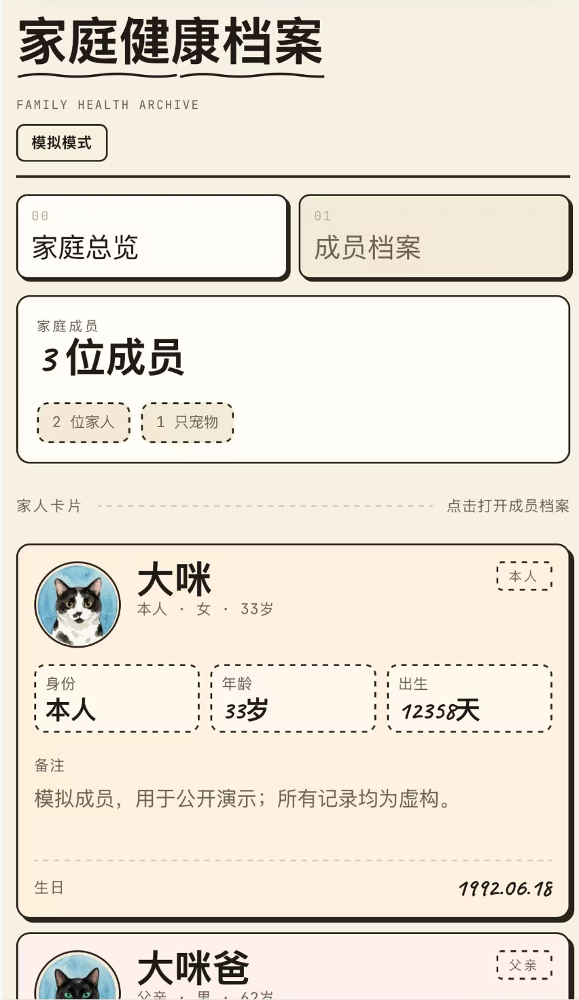
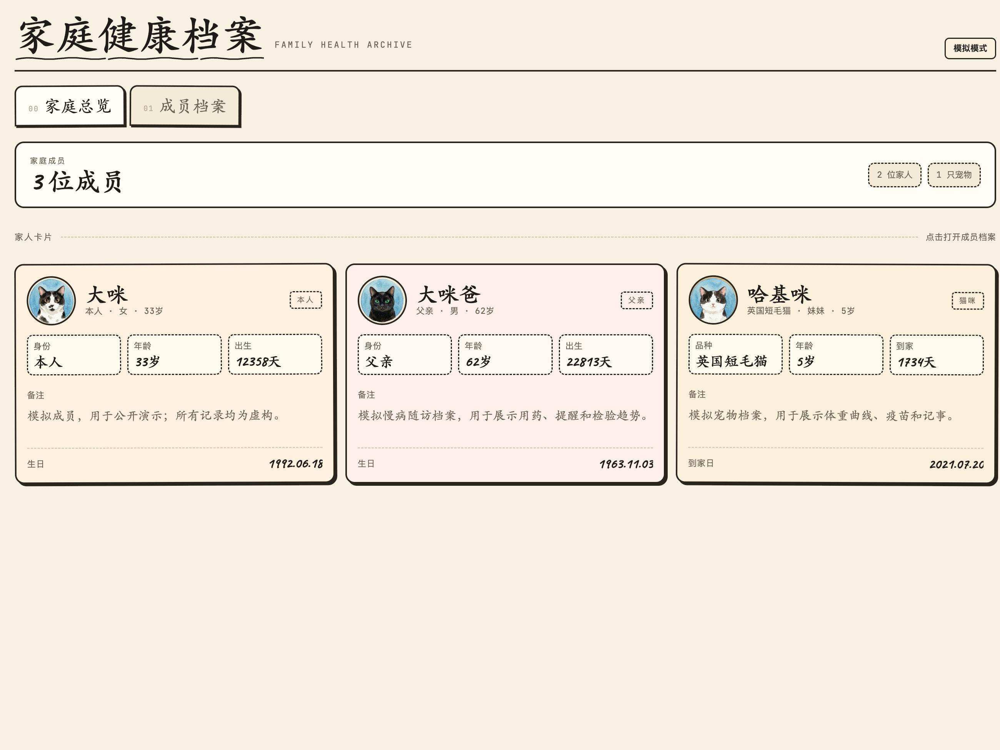
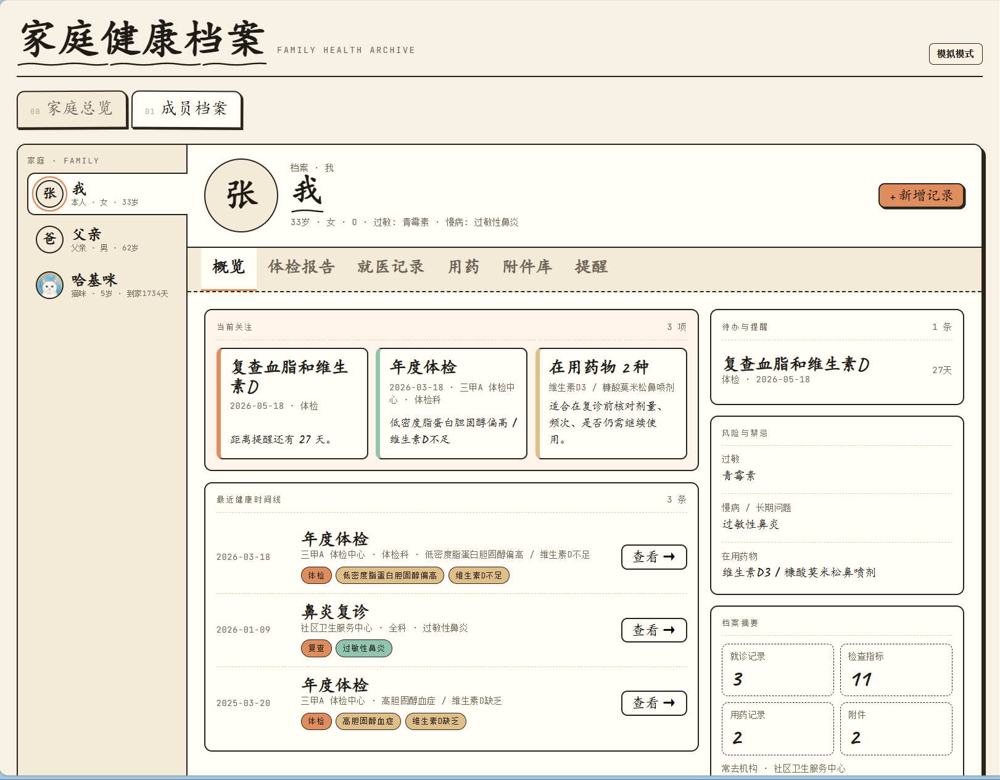
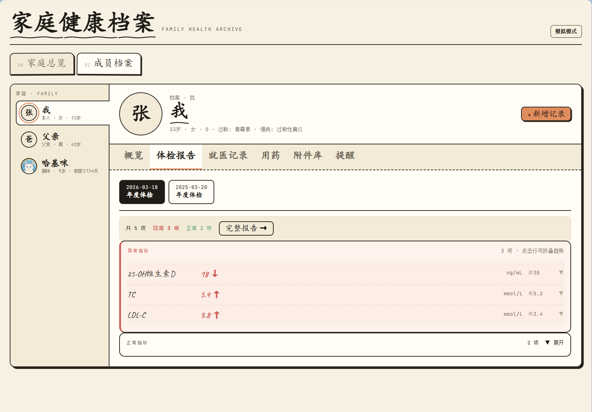

# 家庭健康档案

把散落在手机、邮箱和诊所收据里的体检报告整理进本地数据库，让家人随时查阅。

- **本地优先**：数据只保存在自己的电脑上，不经过任何云服务
- **AI 驱动**：把 PDF 或图片交给 AI agent，它负责解析、归档和写入——你只需确认
- **手机可访问**：通过 Tailscale，家人在手机上也能随时查看

**[→ 在线预览（无需下载）](https://jst-well-dan.github.io/Health-Vault-Agent-Preview/)**

---

## 预览截图

<p align="center">
  
  <br><sub>手机端：成员档案</sub>
</p>

<p>
  
  <br><sub>桌面端：所有家庭成员和宠物一览</sub>
</p>

<p>
  
  <br><sub>个人概览：就诊记录、用药和体重趋势</sub>
</p>

<p>
  
  <br><sub>体检指标：历次检验数值对比</sub>
</p>

## 适合谁

- 想把家人、宠物的体检报告和就诊记录集中保存的人
- 希望 AI agent 帮忙整理 PDF、图片和 Markdown 报告的人
- 希望数据留在本地电脑，同时能用手机随时查看的人

## 最简单的用法

把下面这段话发给你的 AI agent。

```text
请帮我使用这个家庭健康档案项目：
https://github.com/Jst-Well-Dan/Health-Vault-Agent

请先阅读 README.md、AGENTS.md 和 .codex/skills 下的项目技能。
然后先问我这次想做什么，再帮我完成初始化、添加家庭成员和宠物、导入报告或手机访问配置。
```

如果你只想让 agent 安装并启动：

```text
请克隆 https://github.com/Jst-Well-Dan/Health-Vault-Agent，并使用 health-app 帮我安装、初始化和启动家庭健康档案，然后引导我添加家庭成员和宠物。
```

如果你想导入一份报告：

```text
请把我提供的健康报告导入家庭健康档案。需要转换文档时使用 mineru；写入数据库时使用 health-db-writer。
```

如果你想在手机上查看：

```text
请先使用 health-app 确认家庭健康档案已经运行，再使用 health-deploy 引导我通过 Tailscale 在手机浏览器访问。
```

## 使用流程

```text
看在线预览
  ↓
让 AI agent 克隆项目：
https://github.com/Jst-Well-Dan/Health-Vault-Agent
  ↓
agent 使用 health-app 安装、初始化并启动项目
  ↓
agent 引导你添加家庭成员和宠物
  ↓
把报告 PDF / 图片 / Markdown 交给 agent
  ↓
agent 使用 mineru 和 health-db-writer 导入数据
  ↓
agent 使用 health-deploy 配置 Tailscale 手机访问
```

## AI Agent 能力

本仓库内置了 4 个项目技能，覆盖从安装到数据导入的完整流程。

| 技能 | 能做什么 |
|---|---|
| `health-app` | 安装依赖、初始化项目、启动/停止服务、检查运行状态 |
| `mineru` | 把 PDF、图片、Word 或网页转换为 Markdown，支持表格精确提取 |
| `health-db-writer` | 整理导入 JSON、校验数据、备份并写入 SQLite |
| `health-deploy` | 配置 Tailscale 手机访问、远程访问排查、开机自启 |

## 手动启动

如果你熟悉命令行，也可以不借助 agent 手动启动：

```powershell
git clone https://github.com/Jst-Well-Dan/Health-Vault-Agent
cd Health-Vault-Agent
python -m venv .venv
.\.venv\Scripts\Activate.ps1
pip install -r backend\requirements.txt
python backend\scripts\seed_members.py
cd backend
python -m uvicorn main:app --host 0.0.0.0 --port 8000
```

本机访问：

```text
http://127.0.0.1:8000/
```

同一 Tailscale 网络中的手机访问：

```text
http://<电脑的 Tailscale IP>:8000/
```

## 数据目录

```text
backend/              FastAPI 后端、SQLite 初始化、API 路由、导入脚本
frontend/             前端页面和样式
data/health.db        真实数据库，本地个人数据，不要公开提交
data/backups/         数据库备份
data/imports/         agent 生成的导入 JSON
data/reports/         原始报告、Markdown 和图片附件
data/public/          可公开访问的静态资源，如头像和 README 截图
data/mock/            mock 数据库和 mock 附件
docs/                 项目文档和静态预览
.codex/skills/        给 AI agent 使用的项目技能
```

## 数据隐私

所有数据保存在你自己电脑的 `data/health.db`，不经过任何云服务或第三方接口。

- 数据库写入由 `health-db-writer` 执行，包含自动备份和数据校验
- 删除或重置操作需要你明确确认，agent 不会自行执行破坏性操作
- 报告解析存疑时，agent 会暂停并说明问题，而不是静默写入
