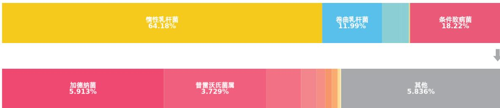
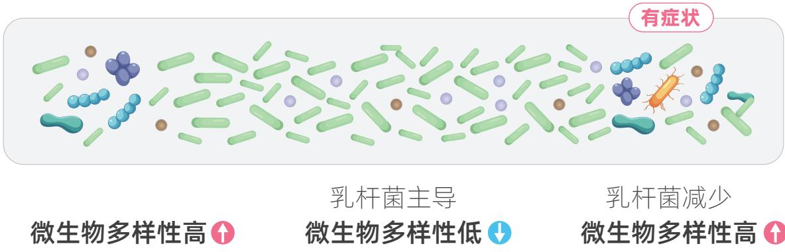
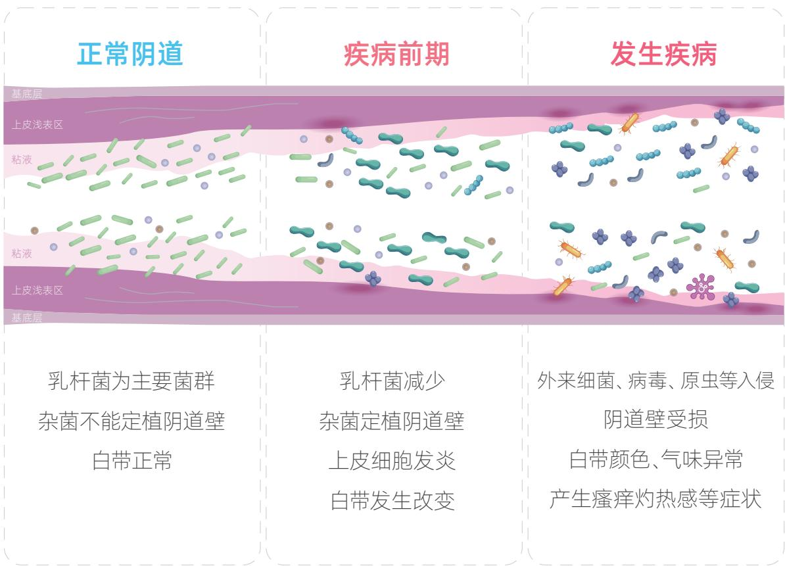
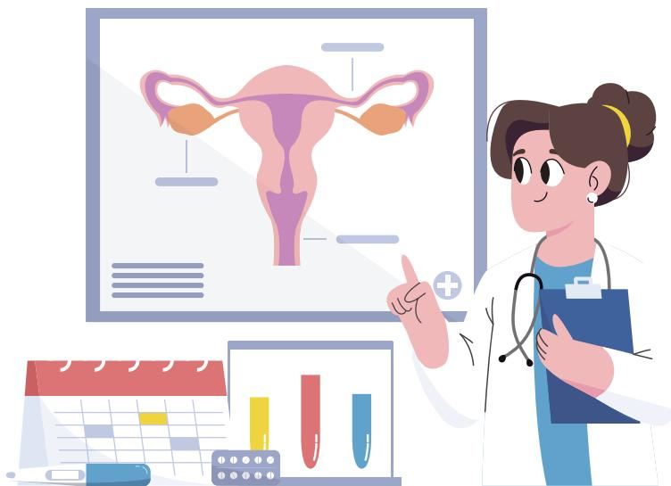
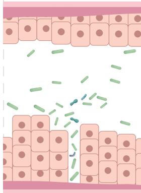
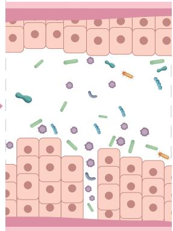
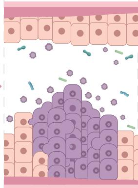
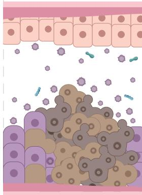

# 生殖道微生态

# 分子检测报告

<table><tr><td>姓名</td><td>杨昭春子</td><td>性别</td><td>女</td></tr><tr><td>年龄</td><td>27</td><td>标本类型</td><td>阴道分泌物</td></tr><tr><td>检测技术</td><td colspan="3">16S扩增子测序技术与荧光定量技术</td></tr><tr><td>检测单位</td><td>南京申友医学检验所</td><td>报告日期</td><td>2024-03-30</td></tr><tr><td>条码</td><td colspan="3">2020240323717</td></tr></table>

*上海南方基因科技有限公司委托南京申友医学检验所完成检测

# 总体结果 ：惰性乳杆菌主导

您的惰性乳杆菌含量 $5 5 0 \%$ ，以惰性乳杆菌为主的微生态可能无法提供足够的保护，建议定期关注生殖道微生态。

您需要关注的项目：您需要关注的项目：无

# $\bigcirc$ 菌群检测结果

<table><tr><td>乳酸菌比例: 81.78%</td><td>(参考值: ≥70%)</td></tr><tr><td>其他菌比例: 18.22%</td><td></td></tr><tr><td>菌属数: 32</td><td>(参考值: &lt;70)</td></tr><tr><td>香浓-威纳指数: 2.7</td><td>(参考值: 0.32-5.5)</td></tr><tr><td>是一个衡量微生物多样性的数值)</td><td></td></tr></table>

<table><tr><td>乳杆菌</td><td>检测结果</td></tr><tr><td>■惰性乳杆菌（Lactobacillus iners）</td><td>64.18%</td></tr><tr><td>■卷曲乳杆菌（Lactobacillus crispatus）</td><td>11.99%</td></tr><tr><td>■詹氏乳杆菌（Lactobacillus jensenii）</td><td>3.84%</td></tr><tr><td>■加氏乳杆菌（Lactobacillus gasseri）</td><td>1.56%</td></tr><tr><td>■阴道乳杆菌（Lactobacillus vaginalis）</td><td>0.03%</td></tr><tr><td>■其他乳杆菌</td><td>0.18%</td></tr></table>

<table><tr><td>条件致病菌</td><td>检测结果</td></tr><tr><td>■加德纳菌（Gardnerella vaginalis）</td><td>5.91%</td></tr><tr><td>■普雷沃氏菌属（Prevotella）</td><td>3.73%</td></tr><tr><td>■阿托波氏菌（Atopobium vaginae）</td><td>1.28%</td></tr><tr><td>■BVAB1</td><td>0.57%</td></tr><tr><td>■巨球型菌1（Megasphaera type-1）</td><td>0.31%</td></tr><tr><td>■BVAB2</td><td>0.25%</td></tr><tr><td>■无乳链球菌（B组）（Streptococcus agalactiae）</td><td>0.21%</td></tr><tr><td>■肺炎克雷伯菌（Klebsiella pneumoniae）</td><td>0.05%</td></tr><tr><td>■咽峡炎链球菌（Streptococcus anginosus）</td><td>0.04%</td></tr><tr><td>■克氏动弯杆菌（Mobiluncus curtisii）</td><td>0.03%</td></tr><tr><td>■肠球菌属（Enterococcus）</td><td>0.01%</td></tr><tr><td>■拟杆菌属（Bacteroides）</td><td>未检出</td></tr><tr><td>■其他（主要是链球菌属、葡萄球菌属、双歧杆菌属等）</td><td>5.84%</td></tr></table>

<table><tr><td>疾病</td><td>物种</td><td>检测结果</td><td>正常范围</td><td>风险评估</td></tr><tr><td rowspan="11">细菌性阴道病(BV)绝经期(中老年)的女性,乳酸杆菌可能&lt;70%,若无症状,请保持关注。</td><td>*乳酸杆菌属(Lactobacillus)</td><td>81.78%</td><td>≥70%</td><td rowspan="11">惰性乳杆菌主导 惰性乳杆菌可能促进某些致病菌在阴道内的定植,从而促进BV的发生</td></tr><tr><td>阿托波氏菌(Atopobium vaginae)</td><td>1.28%</td><td>0-2.24%</td></tr><tr><td>加德纳菌(Gardnerella vaginalis)</td><td>5.91%</td><td>0-9.98%</td></tr><tr><td>BVAB1</td><td>0.57%</td><td>0-1.00%</td></tr><tr><td>BVAB2</td><td>0.25%</td><td>0-0.42%</td></tr><tr><td>普雷沃氏菌属(Prevotella)</td><td>3.73%</td><td>0-4.37%</td></tr><tr><td>纤毛菌属(Sneathia)</td><td>1.63%</td><td>0-1.89%</td></tr><tr><td>巨球型菌(Megasphaera)</td><td>0.31%</td><td>0-0.57%</td></tr><tr><td>克氏动弯杆菌(Mobiluncus curtisii)</td><td>0.03%</td><td>0-0.04%</td></tr><tr><td>其他动弯杆菌属(Mobiluncus)</td><td>未检出</td><td>0-0.09%</td></tr><tr><td>拟杆菌属(Bacteroides)</td><td>未检出</td><td>0-0.06%</td></tr><tr><td rowspan="6">需氧菌性阴道病(AV)</td><td>无乳链球菌(B组)(Streptococcus agalactiae)</td><td>0.21%</td><td>0-0.90%</td><td rowspan="6">正常</td></tr><tr><td>大肠杆菌(Escherichia coli)</td><td>0.23%</td><td>0-1.17%</td></tr><tr><td>葡萄球菌属(Staphylococcus)</td><td>0.01%</td><td>0-0.27%</td></tr><tr><td>肠球菌属(Enterococcus)</td><td>0.01%</td><td>0-0.35%</td></tr><tr><td>肺炎克雷伯菌(Klebsiella pneumoniae)</td><td>0.05%</td><td>0-1%</td></tr><tr><td>咽峡炎链球菌(Streptococcus anginosus)</td><td>0.04%</td><td>0-0.76%</td></tr><tr><td rowspan="7">外阴阴道假丝酵母菌病(VVC)</td><td>白色念珠菌(Candida albicans)</td><td>未检出</td><td>未检出</td><td rowspan="7">正常</td></tr><tr><td>克柔念珠菌(Candida krusei)</td><td>未检出</td><td>未检出</td></tr><tr><td>光滑念珠菌(Candida glabrata)</td><td>未检出</td><td>未检出</td></tr><tr><td>葡萄牙假丝酵母(Candida lusitaniae)</td><td>未检出</td><td>未检出</td></tr><tr><td>近平滑假丝酵母(Candida parapsilosis)</td><td>未检出</td><td>未检出</td></tr><tr><td>热带假丝酵母(Candida tropicalis)</td><td>未检出</td><td>未检出</td></tr><tr><td>杜氏假丝酵母菌(Candida dubliniensis)</td><td>未检出</td><td>未检出</td></tr><tr><td>滴虫性阴道病(TV)</td><td>阴道毛滴虫(Trichomonas vaginalis)</td><td>未检出</td><td>未检出</td><td>正常</td></tr><tr><td rowspan="4">生殖道支原体感染</td><td>人型支原体(Mycoplasma hominis)</td><td>未检出</td><td>未检出</td><td rowspan="4">正常</td></tr><tr><td>解脲支原体(Ureaplasma urealyticum)</td><td>未检出</td><td>未检出</td></tr><tr><td>*微小腺原体(Ureaplasma parvum)</td><td>未检出</td><td>未检出</td></tr><tr><td>生殖支原体(Mycoplasma genitalium)</td><td>未检出</td><td>未检出</td></tr><tr><td rowspan="2">生殖器疱疹</td><td>单纯性疱疹1(Herpes simplex 1)</td><td>未检出</td><td>未检出</td><td rowspan="2">正常</td></tr><tr><td>单纯性疱疹2(Herpes simplex 2)</td><td>未检出</td><td>未检出</td></tr><tr><td>沙眼衣原体感染</td><td>沙眼衣原体(Chlamydia trachomatis)</td><td>未检出</td><td>未检出</td><td>正常</td></tr><tr><td>软下疳</td><td>杜克雷嗜血杆菌(Haemophilus ducreyi)</td><td>未检出</td><td>未检出</td><td>正常</td></tr></table>

*乳酸杆菌过度繁殖，也可能导致细胞溶解性阴道病，若无症状，请保持关注；若有症状，请及时就医。  
*微小脲原体特别容易见于无症状携带。没有症状或者没有伴有其他微生物感染的不需要治疗。

  
宫颈癌易感风险：微生态影响可能轻微

# 建议保持健康生活方式，注意阴道清洁卫生，定期进行体检和生殖道微生态检测

HPV病毒持续感染是已知子宫颈病变的重要因素，分子生物学研究表明，HPV感染与和阴道微生态失调有关。阴道微生态失衡，乳酸杆菌数量及活性降低，HPV更加容易作用于宫颈上皮细胞，导致宫颈上皮内瘤变，增加宫颈癌风险。

参考文献：中华医学会妇产科学分会感染性疾病协作组, 廖秦平, 魏丽惠,等. 高危型人乳头瘤病毒与女性下生殖道感染联合检测专家共识[J]. 中国实用妇科与产科杂志, 2022, 38(5):5.

# O 检测说明

本检测仅用于健康评估和疾病预警，不作为临床诊断。“ ”表示发生相关疾病的风险增高，但不一定代表已发生疾病。“ ”表明相关疾病发病风险较低，但也不排除存在引起疾病的微生物。本次检测结果只对此次送检样本负责，只反映取样时受检者的阴道微生态状态。由机械性刺激、过度清洁等引起的慢性子宫颈炎等炎症，如果没有病原微生物的感染，可能无法检出。考虑到阴道微生态的动态变化，建议定期进行复查，以便及时进行有效干预。考虑到阴道微生态的动态变化，建议定期进行复查，以便及时进行有效干预。

# 女性生殖道微生态与疾病

# 乳杆菌为阴道优势菌群

女性阴道内微生物种类众多，包括细菌、真菌、病毒、支原体、原虫等。正常情况下，阴道内以乳杆菌为优势菌，约占 $70 \% - 9 5 \%$ ，与其他微生物一起组成动态平衡系统，是抵御感染的第一道防线。

# 每年3.5亿人生殖道感染

我国国家卫生健康委员会统计数据表明，每年妇科门诊7亿多人次，约 $50 \%$ 为生殖道感染，已成为全国性的公共卫生问题。

# 常见生殖道疾病

包括细菌性阴道病（BV）、需氧菌性阴道病（AV）、外阴阴道假丝酵母菌病（VVC）和滴虫性阴道病（TV）等。值得注意的是混合性阴道病，由两种或两种以上的致病微生物导致的阴道炎症。如采用单一的治疗方案，经常导致阴道病迁延不愈或反复发作。

# 病原体混合感染疾病

如外阴单纯疱疹病毒2型（HSV-2）、沙眼衣原体（CT）、支原体（mycoplasma）及人乳头瘤病毒（HPV）感染，这些病原体感染可能和阴道炎症同时存在，且症状隐匿，极大增加了正确诊断及规范治疗混合感染的难度。

# O 生殖道微生态分子检测

# 核酸定量

采用16S扩增子测序技术与微流控芯片荧光定量技术实现核酸定量检测，可精准检出阴道内微生物的种类与数量。

# $\odot$ 多物种筛查

一次检测多种微生态感染相关菌群、原虫、支原体、衣原体等，较阴道分泌物显微镜检查，可检出微生物种类更多。

# $\circledast$ 针对性预防

科学评判阴道微生态感染疾病风险，提供健康个性化健康护理建议。

  
关注南方基因官方公众号  
查阅详细版PDF报告

您可通过南方基因官方公众号

和服务热线400-869-0300（工作日8:30-17:00）

免费预约“一对一”报告解读服务

我们将详细为您解读检测结果，并进行健康指导

同时对您的信息严格保密

$\textcircled{4}$ www.my23.cn   
service@southgene.com   
$\circledcirc$ 上海市浦东新区张江高科郭守敬路351号

# 目 录

# 疾病风险

细菌性阴道病（BV） 01   
需氧菌性阴道病(AV) 05   
外阴阴道假丝酵母菌病（VVC） 08  
滴虫性阴道病（TV） 11   
生殖道支原体感染 13  
生殖器疱疹 15  
沙眼衣原体感染 17  
软下疳 19   
宫颈癌易感风险 21

Gge 生殖道微生态介绍 23   
回 检测说明 29  
检测方法 30  
参考文献 32

#

您的惰性乳杆菌含量 $5 5 0 \%$ ，以惰性乳杆菌为主的微生态可能无法提供足够的保护，建议定期关注生殖道微生态，若有症状，请及时就医。

<table><tr><td>物种</td><td>检测结果</td><td>正常范围</td><td>风险评估</td></tr><tr><td>乳酸杆菌属(Lactobacillus)</td><td>81.78%</td><td>≥70%</td><td>—</td></tr><tr><td>阿托波氏菌(Atopobium vaginae)</td><td>1.28%</td><td>0-2.24%</td><td>—</td></tr><tr><td>加德纳菌(Gardnerella vaginalis)</td><td>5.91%</td><td>0-9.98%</td><td>—</td></tr><tr><td>BVAB1</td><td>0.25%</td><td>0-1.00%</td><td>—</td></tr><tr><td>BVAB2</td><td>0.25%</td><td>0-0.42%</td><td>—</td></tr><tr><td>普雷沃氏菌属(Prevotella)</td><td>3.73%</td><td>0-4.37%</td><td>—</td></tr><tr><td>纤毛菌属(Sneathia)</td><td>1.63%</td><td>0-1.89%</td><td>—</td></tr><tr><td>巨球型菌(Megasphaera)</td><td>0.31%</td><td>0-0.57%</td><td>—</td></tr><tr><td>克氏动弯杆菌(Mobiluncus curtisii)</td><td>0.03%</td><td>0-0.04%</td><td>—</td></tr><tr><td>其他动弯杆菌属(Mobiluncus)</td><td>未检出</td><td>0-0.09%</td><td>—</td></tr><tr><td>拟杆菌属(Bacteroides)</td><td>未检出</td><td>0-0.06%</td><td>—</td></tr></table>

*如结果显示未检出，则表明样本中未检测出该微生物，或者浓度低于试剂盒灵敏度

# 疾病介绍

细菌性阴道病是以阴道内正常产生过氧化氢的乳杆菌减少或消失，而以兼性厌氧菌及厌氧菌增多为主导致的阴道感染，是女性最常见的阴道炎类型，反复发作和持续感染会增加发生宫颈癌和感染人类免疫缺陷病毒（HIV）的风险。  
$1 0 \% \sim 4 0 \%$ 的细菌性阴道炎可无症状，出现症状主要表现为阴道分泌物多或有鱼腥样异味，性交后加重，可伴有轻度外阴瘙痒或烧灼感。  
我国调查数据显示，BV在健康体检妇女中约占 $7 7 \%$ ，在妇科门诊阴道炎症患者中占 $3 6 \% \sim 6 0 \%$ 。流行病学调查发现，BV的发生与许多因素相关，如有多个男性或女性性伴、新的性伴、不使用安全套及阴道冲洗等。

# 健康建议

日常生活中应保证充足睡眠，避免过度劳累。  
勤换内裤，尽量选择宽松、棉质的内裤，保持阴道干燥、透气。  
注意性生活卫生，事前事后双方均需清洗外阴，避免频繁性交和频繁更换性伴侣，性交时使用避孕套。  
非医生指导，不要冲洗阴道，避免大量使用抗生素，以免破坏阴道微生态。  
定期复查阴道微生态，若菌群持续失衡，请考虑前往妇科就诊。  
如出现白带增多，有鱼腥臭味，外阴瘙痒或灼烧感的情况，请立即前往妇科就诊。

# 阴道微生物介绍

# 乳酸杆菌属

乳酸杆菌是正常阴道微生物群落中的优势群落，主要功能是产生乳酸，维持阴道内酸性环境 $( \mathsf { P H } < 4 . 5 )$ ），产生 $H _ { 2 } O _ { 2 }$ 和其他抑制细菌的细菌素，同时黏附阴道上皮细胞，形成物理屏障，阻止致病菌的定植，在维持女性生殖道微环境中发挥重要作用。

# 加德纳菌 (Gardnerellavaginalis)

阴道加德纳菌是条件致病菌，在少量存在时不致病，但是在阴道优势菌乳杆菌减少或消失造成阴道内环境失衡的情况下，阴道加德纳菌大量繁殖，多于乳酸菌 $7 0 0 \sim 1 0 0 0$ 倍，便会产生阴道发炎的症状。

# 双歧杆菌属

阴道中存在少量的双歧杆菌，通过产生乳酸来促进阴道微生物群的动态平衡。

# 普雷沃氏菌

普雷沃氏菌是常见的阴道有害菌，可以通过结合或附着在上皮细胞以外的其他细菌上定植，破坏阴道的酸度，并促进其他致病菌的生长。

阿托波氏菌

可在正常阴道菌群中被检测到，但在细菌性阴道病样本中可以检测到较高水平的阴道阿托波氏菌。

BVAB

细菌性阴道病相关细菌，是一种在人阴道中发现的未培养细菌，属于梭状芽胞杆菌科的一个家族，与阴道内阴道分泌物中的促炎细胞因子相关。

拟杆菌属

正常寄居于阴道，数量失衡时是细菌性阴道病致病菌之一。

巨球型菌 （Megasphaera）

Megasphaera 细菌（1型和2型）与细菌性阴道病高度相关，一项研究显示BV患者的浓度更高（高达五倍）。该菌可诱导树突状细胞成熟并增加促炎细胞因子水平。

动弯杆菌 （Mobiluncus）

专性厌氧菌，主要存在于细菌性阴道病患者阴道分泌物中，已发现两个种，柯氏动弯杆菌和羞怯动弯杆菌，与非特异性细菌性阴道病关系密切。

# 正常

需氧菌性阴道病风险较低。请保持阴部卫生，定期复查阴道微生态，及时发现风险，预防发生需氧菌性阴道病。

<table><tr><td>物种</td><td>检测结果</td><td>正常范围</td><td>风险评估</td></tr><tr><td>无乳链球菌（B组）(Streptococcus agalactiae)</td><td>0.21%</td><td>0-0.90%</td><td>-</td></tr><tr><td>大肠杆菌(Escherichia coli)</td><td>0.23%</td><td>0-1.17%</td><td>-</td></tr><tr><td>葡萄球菌属(Staphylococcus)</td><td>0.01%</td><td>0-0.27%</td><td>-</td></tr><tr><td>肠球菌属(Enterococcus)</td><td>0.01%</td><td>0-0.35%</td><td>-</td></tr><tr><td>肺炎克雷伯菌(Klebsiella pneumoniae)</td><td>0.05%</td><td>0-1%</td><td>-</td></tr><tr><td>咽峡炎链球菌(Streptococcus anginosus)</td><td>0.04%</td><td>0-0.76%</td><td>-</td></tr></table>

*如结果显示未检出，则表明样本中未检测出该微生物，或者浓度低于试剂盒灵敏度

# 疾病介绍

需氧菌性阴道病（aerobic vaginitis，AV）是由阴道内乳杆菌水平下降、需氧菌增多引起的阴道炎症。还易合并其他阴道感染。  
AV不仅可导致患者外阴阴道不适，还与盆腔炎症性疾病、不孕症以及流产、早产、胎膜早破、绒毛膜羊膜炎、新生儿感染、产褥感染等不良妊娠结局有关。AV也会增加性传播病原体（如HPV、HIV、阴道毛滴虫、沙眼衣原体等）的感染风险。

据国内外研究报道显示，AV的发病率为 $4 . 9 \% \sim ] 1 . 8 \%$ ，其在阴道炎症中所占比例为9.4%~23.7%。AV的致病原因尚未完全明确，有研究发现，使用宫内节育器、长期使用抗菌药物、反复阴道灌洗为AV发病的独立危险因素。

# 健康建议

注意勤洗、勤换内裤，注意外阴的清洁、干燥。  
注意性生活的健康，避免多个性伴侣，同时要避免紊乱的性生活和经期性生活，同时要注意性伴侣的本身状况。  
非医生指导下，不要频繁进行阴道灌洗，避免大量使用抗生素，以免破坏阴道内环境。  
定期复查阴道微生态，及时发现风险。

# 阴道微生物介绍

# 无乳链球菌（B组）

无乳链球菌是寄居于人体的一种条件致病菌，通常存在于女性的阴道。青春期的女性，可能阴道菌群并不是以乳杆菌为优势菌的，而是以无乳链球菌或者咽峡炎链球菌等为正常的菌群。

# 大肠杆菌

是需氧菌性阴道病的病原体之一，发病时大肠杆菌等需氧菌增加，与正常阴道菌群相比，这些需氧菌使阴道黏膜发生炎症的机率增加了3-5 倍。

# 葡萄球菌

葡萄球菌是一群革兰氏阳性球菌，因常堆聚成葡萄串状，故名葡萄球菌。大部分是不致病的腐生菌，数量增多引起需氧菌性阴道病。

# 粪肠球菌 (Enterococcus faecalis)

属于革兰阳性球菌。它是人体阴道菌群的一部分，大量存在于阴道中则容易引起需氧菌性阴道病。

# 外阴阴道假丝酵母菌病（VVC）

# 正常

外阴阴道假丝酵母菌病风险较低。请保持阴部卫生，定期复查阴道微生态，及时发现风险，预防发生外阴阴道假丝酵母菌病。

<table><tr><td>物种</td><td>检测结果</td><td>正常范围</td><td>风险评估</td></tr><tr><td>白色念珠菌(Candida albicans)</td><td>未检出</td><td>未检出</td><td>-</td></tr><tr><td>克柔念珠菌(Candida krusei)</td><td>未检出</td><td>未检出</td><td>-</td></tr><tr><td>光滑念珠菌(Candida glabrata)</td><td>未检出</td><td>未检出</td><td>-</td></tr><tr><td>葡萄牙假丝酵母(Candida lusitaniae)</td><td>未检出</td><td>未检出</td><td>-</td></tr><tr><td>近平滑假丝酵母(Candida parapsilosis)</td><td>未检出</td><td>未检出</td><td>-</td></tr><tr><td>热带假丝酵母(Candida tropicalis)</td><td>未检出</td><td>未检出</td><td>-</td></tr><tr><td>杜氏假丝酵母菌(Candida dubliniensis)</td><td>未检出</td><td>未检出</td><td>-</td></tr></table>

*如结果显示未检出，则表明样本中未检测出该微生物，或者浓度低于试剂盒灵敏度

# 疾病介绍

外阴阴道假丝酵母菌病（vulvo vginal candidiasis, VVC）是由假丝酵母菌引起的常见外阴阴道病症，其他如光滑假丝酵母菌、热带假丝酵母菌、近平滑假丝酵母菌等占少数。发病率居阴道感染性疾病的第2位，仅次于细菌性阴道病。

临床表 现为：（1）症状：外阴瘙痒、灼痛，还可伴有尿痛以及性交痛等症状；白带增多。（2）体征∶外阴潮红、水肿，可见抓痕或皲裂，小阴唇内侧及阴道黏膜附着白色膜状物，阴道内可见较多的白色豆渣样分泌物，可呈凝乳状。  
V VC患者经过治疗后，不注意个人生殖健康的女性患者中，$70 \%$ 以下会出现病症再现，转变为复发性外阴阴道假丝酵母菌病（recurrent vulvoaginal candidiasis, RV VC），如果不积极治疗或治疗不彻底，会导致病情反复发作，迁延难愈，严重影响妇女身心健康。

# 健康建议

注意阴部卫生，勤换内裤，尽量选择宽松、棉质的内裤，保持阴道干燥、透气。  
非医生指导下，不要频繁进行阴道灌洗，以免破坏阴道内环境。  
饮食方面以清淡、易消化的食物为主，减少海鲜、动物内脏类食物，禁食冷、热、油腻及刺激性食物。  
增加维生素含量较高的食物，如蔬菜、水果。  
按时休息，保证作息规律，加强运动锻炼。  
。 定期复查阴道微生态，及时发现风险。

# 阴道微生物介绍

# 白色念珠菌 （Candida albicans）

念珠菌是一种条件致病真菌，通常状态下与其他微生物群体共栖于健康人体的口咽、胃肠道及泌尿生殖道部位，在阴道微环境中无症状正常人群念珠菌带菌率为 $70 - 3 0 \%$ 。大约$7 5 \%$ 的女性一生中至少会经历一次酵母菌感染，几乎所有这些感染（ $( 9 0 \% )$ ）都是由白色念珠菌引起的。

# 克柔念珠菌

克柔念珠菌感染的外阴阴道炎是一种罕见的酵母菌感染，引起约 $7 \%$ 的外阴阴道念珠菌病病例。

# 光滑念珠菌

光滑念珠菌是仅次于白色念珠菌的第二常见真菌病原体,由该菌引起的感染可导致外阴阴道念珠菌病。

# 葡萄牙假丝酵母 （Candida lusitaniae）

葡萄牙假丝酵母引起的外阴阴道炎比较罕见。

# 近平滑假丝酵母

也被称为半光假丝酵母，是一种条件致病性假丝酵母。

# 热带假丝酵母 （Candida tropicalis）

即热带念珠菌，是一种双相型单细胞酵母菌，是生殖器念珠菌病的第二病原菌。

# 杜氏假丝酵母菌

是一种条件致病真菌，在表型上与白色念珠菌相似。

# 正常

未检出阴道毛滴虫，滴虫性阴道病风险较低。请保持阴部卫生，定期复查阴道微生态，及时发现风险，预防发生滴虫性阴道病。

<table><tr><td>物种</td><td>检测结果</td><td>正常范围</td><td>风险评估</td></tr><tr><td>阴道毛滴虫(Trichomonas vaginalis)</td><td>未检出</td><td>未检出</td><td>-</td></tr></table>

*如结果显示未检出，则表明样本中未检测出该微生物，或者浓度低于试剂盒灵敏度

# 疾病介绍

滴虫性阴道病是由阴道毛滴虫感染所致，属于性传播感染（STI），常与细菌性阴道病、沙眼衣原体感染和淋病并存。  
滴虫性阴道病可导致不良生殖健康结局，包括子宫颈病变、子宫切除术后残端蜂窝织炎或脓肿、盆腔炎症性疾病、不孕症、增加HIV感染易感性、增加子宫颈癌风险，尤其是阴道毛滴虫与HPV共同感染时增加子宫颈癌风险更明显。妊娠合并滴虫性阴道病患者早产、胎膜早破、低出生体重儿、新生儿滴虫感染和新生儿死亡发生率增高。

高危性行为、HIV感染、性伴数增加、低社会经济地位及阴道灌洗是滴虫性阴道病的高发因素。

# 健康建议

每年进行一次妇科检查。  
注意公共场所卫生，尽量不用公共浴盆、公共厕所内尽量选择蹲坑、不到消毒不严格的公共游泳池游泳、出差旅游尽量使用自己带的浴巾等。  
保持外阴部清洁。健康女性切莫乱用各种阴道洗液，只需每日用清水洗外阴、每日换洗内裤、养成便前便后洗手的习惯。  
。 注意性卫生及经期卫生。

# 阴道微生物介绍

阴道毛滴虫 （Trichomonas vaginalis）

阴道毛滴虫是一种寄生在人体阴道及泌尿道的具有鞭毛的真核生物，呈椭圆形。可通过细胞黏附、细胞吞噬、细胞毒及对细胞外基质的降解作用，损伤生殖道上皮，获取生存所需营养，并且可引起白细胞浸润以及逃避宿主免疫反应，引起阴道炎。

# Θ正常

生殖道支原体感染风险较低。请保持阴部卫生，定期复查阴道微生态，及时发现风险，预防发生生殖道支原

<table><tr><td>物种</td><td>检测结果</td><td>正常范围</td><td>风险评估</td></tr><tr><td>人型支原体(Mycoplasma hominis)</td><td>未检出</td><td>未检出</td><td>-</td></tr><tr><td>解脲脲原体(Ureaplasma urealyticum)</td><td>未检出</td><td>未检出</td><td>-</td></tr><tr><td>微小豚原体(Ureaplasma parvum)</td><td>未检出</td><td>未检出</td><td>-</td></tr><tr><td>生殖支原体(Mycoplasma genitalium)</td><td>未检出</td><td>未检出</td><td>-</td></tr></table>

*如结果显示未检出，则表明样本中未检测出该微生物，或者浓度低于试剂盒灵敏度

# 疾病介绍

生殖道支原体感染是由支原体感染引起的一种常见生殖系统疾 病，目前已成为许 多国家和地区常见的性传播疾 病之一。可造成广泛的生殖道感染，其发病率近年呈上升趋势，与异位妊娠的关系日益受到临床关注。支原体寄居于人的泌尿生殖道黏膜，主要通过性传播和母亲的垂直传播。如果感染了生殖支原体，可能会导致男性非淋菌性尿道炎，其特征是尿道瘙痒、烧灼感和排尿困难。少数人尿频，尿道口红肿，分泌物稀薄。

女性生殖支原体感染可导致非淋菌性泌尿生殖道感染，其特征为尿频、尿急、尿痛、尿道灼烧、白带增多、盆腔炎、输卵管炎等。女性如果持续的生殖道支原体感染，有可能会导致不孕、流产以及宫外孕。

# 健康建议

非医生指导下，不要频繁进行阴道灌洗，以免破坏阴道内环境。  
避免大量使用抗生素，以免引起阴道微生物环境紊乱。  
加强锻炼，提高自身体质和免疫力。  
定期复查阴道微生态，及时发现风险。

# 阴道微生物介绍

# 支原体科

其下分为支原体属、脲原体属。能够从人体分离出的支原体共有16种，其中7种对人体有致病性。常见的与泌尿生殖道感染有关的支原体有解脲脲原体(U.urealyticum，Uu)、人型支原体(M.hominis，Mh)、生殖支原体(M.genitali-um，Mg)。支原体是泌尿系感染的常见致病微生物，由支原体导致的泌尿系感染以尿道炎最为多见，其他还包括肾盂肾炎等。目前认为非淋菌造成的尿道炎中， $3 5 \% \sim 5 0 \%$ 与衣原体感染相关， $2 0 \% \sim 4 0 \%$ 与支原体相关，其余病因尚不清楚。

和以上几种支原体不同的是，微小脲原体(Ureaplasma parvum，Up)特别容易见于无症状携带。没有症状或者没有伴有其他微生物感染的不需要治疗，但是仍需保持外阴清洁。

# 正常

生殖器疱疹风险较低。请保持阴部卫生，定期复查阴道微生态，及时发现风险，预防发生生殖器疱疹。

<table><tr><td>物种</td><td>检测结果</td><td>正常范围</td><td>风险评估</td></tr><tr><td>单纯性疱疹1(Herpes simplex 1)</td><td>未检出</td><td>未检出</td><td>-</td></tr><tr><td>单纯性疱疹2(Herpes simplex 2)</td><td>未检出</td><td>未检出</td><td>-</td></tr></table>

*如结果显示未检出，则表明样本中未检测出该微生物，或者浓度低于试剂盒灵敏度

# 疾病介绍

生殖器疱疹( Herpes Genitalis,GH)是一种慢性,持续终生的病毒感染性疾病。两类单纯疱疹病毒可引起生殖器疱疹:1型单纯疱疹病毒(HSV-1)和2型单纯疱疹病毒(HSV-2）。主要表现为生殖器部位出现水疱、疼痛、瘙痒或溃疡。在最初感染后，病毒会在身体中处于休眠状态，可以因抵抗力下降而被激活。HSV可终生潜伏在人体内，在一定条件下病毒再度活跃，导致生殖器疱疹常呈慢性反复发作的过程。

# 健康建议

洁身自好，注意性卫生。  
少食辛辣刺激食物，建议少饮酒。  
保持外阴部清洁。健康女性切莫乱用各种阴道洗液，只需每日用清水洗外阴、每日换洗内裤、养成便前便后洗手的习惯。  
加强锻炼，提高自身体质和免疫力。  
定期复查阴道微生态，及时发现风险。

# 阴道微生物介绍

# 单纯性疱疹1

主要是引起生殖器以外的皮肤粘膜（如口腔、角膜）和器官（如脑）的感染。

# 单纯性疱疹2

单纯性疱疹2是生殖器疱疹的主要病原。

# 正常

沙眼衣原体感染风险较低。请保持阴部卫生，定期复查阴道微生态，及时发现风险，预防发生沙眼衣原体感染。

<table><tr><td>物种</td><td>检测结果</td><td>正常范围</td><td>风险评估</td></tr><tr><td>沙眼衣原体(Chlamydia trachomatis)</td><td>未检出</td><td>未检出</td><td>-</td></tr></table>

*如结果显示未检出，则表明样本中未检测出该微生物，或者浓度低于试剂盒灵敏度

# 疾病介绍

沙眼衣原体感染是由沙眼衣原体引起的一组疾病。沙眼衣原体（chlamydia trachomatis，CT）是生殖道感染常见的病原体，由它引起的急性或慢性生殖道感染，感染后部分患者(尤其是女性)通常没有症状或症状轻微，常常容易忽略，未能引起患者重视以至于耽误治疗。长期感染者可引起严重的并发症，如不孕不育、盆腔炎、异位妊娠等不良结局，甚至作为宫颈癌独立的致癌因素，促进宫颈癌的发生。

# 健康建议

o 注意勤洗、勤换内裤，注意外阴的清洁、干燥。  
注意性生活的健康，避免多个性伴侣，同时要避免紊乱的性生活和经期性生活，同时要注意性伴侣的本身状况  
。 处于青春期的女性，不建议提前性行为年龄。  
非医生指导下，不要频繁进行阴道灌洗，避免大量使用抗生素，以免破坏阴道内环境。  
定期复查阴道微生态，及时发现风险。

# 阴道微生物介绍

# 沙眼衣原体 （Chlamydia trachomatis）

沙眼衣原体是生殖道感染常见的病原体，可引起的急性或慢性生殖道感染。

# Θ正常

软下疳感染风险较低。请保持性卫生，定期复查阴道微生态，及时发现风险，预防发生软下疳感染。

<table><tr><td>物种</td><td>检测结果</td><td>正常范围</td><td>风险评估</td></tr><tr><td>杜克雷嗜血杆菌(Haemophilus ducreyi)</td><td>未检出</td><td>未检出</td><td>-</td></tr></table>

*如结果显示未检出，则表明样本中未检测出该微生物，或者浓度低于试剂盒灵敏度

# 疾病介绍

软下疳(chancroid,soft chancre)是由杜克雷嗜血杆菌(He-mophilus ducreyi)引起的一种性传播疾病。该病可能是生殖器溃疡的常见原因。临床表现为生殖器部位1个或多个疼痛性溃疡,可伴有疼痛性腹股沟淋巴结肿大。  
软下疳能增加HIV感染，软下疳的并发症∶ $\textcircled{1}$ 腹股沟淋巴结炎即炎症性横痃，约 $50 \%$ 患者可以发生，一般出现在原发损害发生后数天到3周，单侧或双侧淋巴结增大，有触痛，皮肤表面发红有波动，可破溃形成一长而窄的浅溃疡。女性淋巴结炎相对少见，推测是女性生殖道淋巴液引流与男性不同所致。 $\textcircled{2}$ 软下疳也可合并梅毒，形成混合性下疳（mixed chancre）。

# 健康建议

注意勤洗、勤换内裤，注意外阴的清洁、干燥。  
注意性生活的健康，避免多个性伴侣，同时要避免紊乱的性生活和经期性生活，每次性行为都应使用安全套，同时要注意性伴侣的本身状况。  
非医生指导下，不要频繁进行阴道灌洗，避免大量使用抗生素，以免破坏阴道内环境。  
。 定期复查阴道微生态，及时发现风险。

# 阴道微生物介绍

# 杜克雷嗜血杆菌 （Hemophilus ducreyi）

杜克雷嗜血杆菌属于革兰阴性杆菌。一旦感染，能够引起性传播疾病(STD)，即软下疳。患者生殖器部位可出现脓疱或溃疡，并伴有疼痛等不适症状。部分患者出现局部溃疡后，还可继发腹股沟化脓性淋巴结炎。

#

建议保持健康生活方式，注意阴道清洁卫生，定期进行体检和生殖道微生态检测

轻微

略高

较高

# 疾病介绍

宫颈癌是指发生在宫颈阴道部及宫颈管的恶性肿瘤，是全球范围内第四大常见的女性恶性肿瘤。宫颈癌癌前病变是指宫颈上皮内瘤变，长期存在可能转变为宫颈癌。  
宫颈癌及其癌前病变与持续感染高危型 HPV（人乳头瘤病毒）有关。正常情况下乳酸杆菌在阴道菌群中居于优势地位，可抑制宫颈癌及癌前病变的发生及发展。一旦阴道微生态失衡，乳酸杆菌数量及活性降低，HPV更加容易作用于宫颈上皮细胞，导致宫颈上皮内瘤变风险增加，长期感染可导致宫颈癌。

因此，维持阴道内乳酸杆菌的正常比例，可以有效预防生殖系统癌前病变，阻断癌症的进程。

# 健康建议

定期进行阴道微生态、HPV分型及液基薄层细胞检测（TCT）。  
积极接种HPV疫苗，目前已有三种类型的 HPV 疫苗，2 价、4 价、9 价，适合不同年龄的女性。  
注意性生活卫生，事前事后双方均需清洗外阴，避免频繁性交和频繁更换性伴侣，性交时使用避孕套。  
。 戒烟戒酒，避免长期口服避孕药。  
适量运动，提高身体免疫力。  
注意休息，保持充足的睡眠。

# 生殖道微生态介绍

# 生殖道微生态系统

女性阴道为开放性腔道，是人体内重要微生态区系。阴道内微生物种类众多，包括细菌、真菌、病毒、支原体、衣原体、原虫等。  
正常的阴道微生物以乳酸杆菌为优势菌，生成乳酸，维持阴道内酸 性 环 境（PH 值 为3. 8 - 4.5），同时产生 抗 菌素、过 氧化 氢$( H _ { 2 } O _ { 2 } )$ ）等抑菌杀菌物质。而且，乳酸杆菌会粘附阴道内皮表面，形成屏障，阻止外来菌进侵入，促进和维持女性生殖健康。

# 阴道微生态在生命周期中的变化

女性阴道内微生物的定植始于新生儿诞生24h内，而后伴随着女性一生。  
幼童时期，阴道内主要是需氧菌、厌氧菌、肠源性细菌，PH为中性或弱碱性。  
育龄阶段，雌激素水平上升，阴道内皮增厚，促使女性阴道内乳酸菌迅速增加。  
绝经时期，女性雌激素水平下降，阴道粘膜萎缩，导致乳杆菌数量降低，加德纳菌、普雷沃氏菌和大肠杆菌等需氧菌和厌氧菌增加。

  
乳杆菌

  
杂菌

  
原虫

  
衣原体

  
青春期前期

  
绝经前期

  
更年期和绝经后

出生

青春期

更年期和绝经后

# 雌激素水平

# 阴道微生态在月经周期中的变化

月经是影响育龄期女性阴道菌群变化的重要因素之一，经血的冲刷造成阴道菌群的流失，雌激素和孕激素水平的周期性波动影响现乳酸菌的数量。  
研究表明，在月经期非乳酸菌等其他细菌大量增加，而乳酸杆菌的数量保持不变或减少。

# 阴道微生态失衡与疾病

正常的阴道微环境处于一种平衡稳定的状态，是抵御外界感染的第一道防线。  
这种平衡一旦被打破，阴道内优势菌被条件致病菌或侵入机体的病原体所替代，就会导致生殖道感染疾病。

乳杆菌

原虫

支原体

杂菌

病毒

衣原体

# 生殖道微生态失衡导致疾病发生过程

女性生殖道感染已成为中国乃至全球性的社会及公共卫生问题，据世界卫生组织(WHO)数据估计，中国每年有超过2亿妇女饱受生殖道感染相关疾病的困扰。我国国家卫生健康委员会统计数据表明，每年妇科门诊7亿多人次，约 $50 \%$ 为生殖道感染。  
生殖道感染包含因细菌、真菌、病毒、原虫、衣原体以及支原体等病原微生物导致的疾病，具有发病率高、复发率高、治愈率低、抗生素合理使用率低等特点。  
常见的生殖道感染包括，细菌性阴道病（BV）、需氧菌性阴道病（AV）、外阴阴道假丝酵母菌病（VVC）、滴虫性阴道病（TV）。  
值得注意的是混合性阴道病，是由两种或两种以上的致病微生物导致的阴道炎症。研究表明，同时感染阴道两种以上病原微生物的概率为 $2 7 . 9 \%$ 。

# 常见生殖道感染类型（30种）

<table><tr><td>单一感染（8种）</td><td colspan="2">混合感染（22种）</td></tr><tr><td></td><td>双重感染（16种）</td><td>多重感染（6种）</td></tr><tr><td>需氧菌性阴道病AV</td><td>VVC+BV</td><td>AV+BV+VVC</td></tr><tr><td>细菌性阴道病BV</td><td>AV+BV</td><td>AV+BV+TV</td></tr><tr><td>滴虫性阴道病TV</td><td>VVC+AV</td><td>VVC+BV+TV</td></tr><tr><td>外阴阴道假丝酵母菌病VVC</td><td>VVC+TV</td><td>AV+TV+VVC</td></tr><tr><td>沙眼衣原体感染CT</td><td>TV+AV</td><td>AV+BV+TV+VVC</td></tr><tr><td>支原体感染（UU、Mh、MG）</td><td>TV+BV</td><td>TV+UU+CT</td></tr><tr><td>生殖器疱疹（HSV-Ⅰ/HSV-Ⅱ）</td><td>BV+CT</td><td></td></tr><tr><td>软下疳</td><td>BV+UU</td><td></td></tr><tr><td></td><td>BV+Mh</td><td></td></tr><tr><td></td><td>BV+MG</td><td></td></tr><tr><td></td><td>AV+CT|TV+CT</td><td></td></tr><tr><td></td><td>TV+UU</td><td></td></tr><tr><td></td><td>TV+UU</td><td></td></tr><tr><td></td><td>TV+Mh</td><td></td></tr><tr><td></td><td>TV+MG</td><td></td></tr></table>

在关注各种阴道病混合感染的同时，我们也需要关注女性外 阴、阴道及宫颈相关病原体的混合感染问题。如外阴单纯疱疹病毒Ⅱ型（HSV-Ⅱ）、沙眼衣原体（CT）、支原体（mycoplasma） 等。这些病原体感染可能和阴道炎 症同时存在，且症状隐匿，极大增加了临床医师正确诊断规范 治疗混合感染的难度。

# 生殖道微生态感染还会增加宫颈癌风险

乳杆菌

杂菌

病毒

原虫

支原体

衣原体

# - 微生态失衡导致宫颈癌过程

  
正常生殖道

乳 酸 杆 菌 为优 势 菌 抑 制H P V 病 毒 附着阴道壁

  
生殖道微生态失衡

乳酸杆菌数量与活性降低，高危HPV病毒大 量 复 制，附着阴道壁与子宫颈上皮细胞

  
癌前病变

高危HPV病毒嵌 入子宫颈 及阴道上皮细胞基 因 组 ，致 细胞过度增殖，引发内瘤变

  
宫颈癌

高危HPV病毒长 期 感 染 ，宫颈上皮内瘤变突破基底层，导致宫颈癌

HPV病毒持续感染是已知子宫颈病变的重要因素，分子生物学研究表明，HPV感染与和阴道微生态失调有关。阴道微生态失衡，乳酸杆菌数量及活性降低，HPV更加容易作用于宫颈上皮细胞，导致宫颈上皮内瘤变，增加宫颈癌风险。

# 检测说明

阴道微生态检测并不直接进行诊断或微生物病原诊断，仅用于健康评估和疾病预警，不作为临床诊断。  
。 疾病风险评估，“关注”表示发生相关疾病的风险增高，但不一定代表已发生疾病。“正常”表明相关疾病发病风险较低，但也不排除存在引起疾病的微生物。  
如需进行医疗决策，请咨询医生，结合临床症状及其他指标，在医生指导下开展相应的治疗计划。  
阴道微生态始终处于动态变化的过程，受多种因素影响，如性生活频率、环境卫生情况、是否使用抗生素等。因此，本报告只对送检样本的检测结果负责，仅反映受检者在采样时的阴道微生态状况。  
本检测报告可能包括了一些微生物信息，此信息参考国内外权威文献和其他公开可用的数据库。疾病分析中提供患病的概率可能受限于样本规模和个体状态。本检测部分指标可能也会影响本报告中未提及的其他健康状况。

# 检测方法

本测试采用16S扩增子测序技术与荧光定量技术，对受检者的阴道微生物进行生物信息分析，获得阴道微生物的功能、组成和多样性信息。  
该试验检测以下微生物的存在：加德纳菌（Gardnerella vaginalis）、惰性乳杆菌（Lactobacillus iners）、卷曲乳杆菌（Lactobacillus crispa-tus）、普雷沃氏菌属（Prevotella）、詹氏乳杆菌（Lactobacillusjensenii）、双歧杆菌属（Bifidobacterium）、大肠杆菌（Escherichiacoli）、BVAB1、阿托波氏菌（Atopobium vaginae）、拟杆菌属（Bacte-roides）、巨球型菌1（Megasphaera type-1）、格氏乳杆菌（Lactoba-cillus gasseri）、解脲脲原体（Ureaplasma urealyticum）、BVAB3、支原体科（Mycoplasmataceae）、阴道乳杆菌（Lactobacillus vaginal-is）、BVAB2、肺炎克雷伯菌（Klebsiella pneumoniae）、动弯杆菌属（Mobiluncus）、无乳链球菌（B组）（Streptococcus agalactiae）、克氏动弯杆菌（Mobiluncus curtisii）、肠球菌（Enterococcus）。  
其中，人 型 支 原体 (M ycopl asma hominis)、解脲 脲 原体(Ureaplasma urealyticum)、生殖支原体(Mycoplasma genitali-um)、单纯性疱疹1、2(Herpes simplex 1，2)、沙眼衣原体(Chla-mydia trachomatis)、杜克雷嗜血杆菌(Haemophilus ducreyi)、白色念珠菌(Candida albicans)、克柔念珠菌(Candida krusei)、光滑念珠菌(Candida glabrata)、葡萄牙假丝酵母(Candida lusitaniae)、

近平滑假丝酵母(Candida parapsilosis)热带假丝酵母(Candida-tropicalis)、等部分有害菌检出结果通过荧光定量PCR技术进行再次确认。

使用新一代测序平台MGI-2000，其特有的DNA纳米球测序技术，线性扩增无错误积累，具有高准确性，低重复序列率和低标签跳跃率，已获得国家药品监督管理局医疗器械注册认证。  
Fluidigm BioMark HD基因分析系统整合先进的微流控芯片和qPCR技术，采用动态芯片/数码芯片和实时荧光信号检测系统,高通量，灵敏度高，可精确至单细胞水平。  
参考Nature、Science、Cell等权威期刊的文献，结合不同表型的自有万人样本库，使用最新Qiime2数据分析流程，结合机器学习和人工智能技术，对疾病易感性做出更加准确的预测。  
创新一体化采集和保存方案。使用稳定剂持续保护样本，支持室温运输，能精准检测与新鲜样本一致的微生物组成特征。自主研发微生物核酸分离提取技术，通过自动化高通量提取，起始量限制低，重复稳定。

[1] 中华医学会妇产科学分会感染性疾病协作组. 细菌性阴道病诊治指南[J]. 中华妇产科杂志，2021，56(1)：3-6.  
[2] Verstraelen H, Verhelst R, Claeys G, et al. Culture-independent analysis of vaginal microflora: the unrecognized association of Atopobium vaginae with bacterial vaginosis[ J]. Am J Obstet Gynecol, 2004, 191(4): 1130-2.   
[3] FANNY G，CATHERINE D，MURIEL T，et al.Occurrence and dynamism of lactic acid bacteria in distinct ecological niches：a multifaceted functional health perspective[ J].Front Microbiol，2018，9：2899.   
[4] Mls J,Stráník J, Kacerovský M. Lactobacillus iners-dominated vaginal microbiota in pregnancy. Ceska Gynekol. 2019;84(6):463‐467.   
[5] Petrova MI, Reid G, Vaneechoutte M, Lebeer S. Lactobacillus iners: Friend or Foe?. Trends Microbiol. 2017;25 (3):182‐191.   
[6] Vaneechoutte M. Lactobacillus iners, the unusual suspect. Res Microbiol. 2017;168(9-10):826‐836.   
[7] Veer C,Hertzberger RY,Bruisten SM, et al. Comparative Genomics of Human Lactobacillus Crispatus Isolates Reveals Genes for Glycosylation and Glycogen Degradation: Implications for in Vivo Dominance of the Vaginal Microbiota. Microbiome[ J]. 2019;29(1):49.   
[8] Lepargneur JP. Lactobacillus Crispatus as Biomarker of the Healthy Vaginal Tract. Ann Biol Clin[ J]. 2016;74 (4):421-7.   
[9] Xu HY, Tian WH, Wan CX, et al. Antagonistic potential against pathogenic microorganisms and hydrogen peroxide production finding genous lactobacillii solated from vagina of Chinese pregnant women. Biome Environ Sci[ J]. 2008,21(5):365-371.   
[10] 王帅,庄辉,等. 阴道来源的乳杆菌抑菌物质研究进展. 中国病原生物学杂志[ J]. 2014,9(5),466-469.  
[11] 王敏,宋磊,等. 223 例健康育龄妇女阴道内乳酸杆菌菌群的鉴定. 中国妇产科临床杂志[ J]. 2009,10(3),200-203.  
[12] SiJ, YouHJ, YuJ, et al. Prevotella as a hub for vaginal microbiota under the influence of host genetics and their association with obesity[ J]. Cell Host Microbe, 2017, 21(1):97-105. DOI: 10.1016/j.chom.2016.11.010.   
[13] Petrova MI, Lievens E, Malik S, Imholz N, Lebeer S. Lactobacillus species as biomarkers and agents that can promote various aspects of vaginal health. Front Physiol. 2015;6:81.   
[14] Veer C,Hertzberger RY,Bruisten SM, et al. Comparative Genomics of Human Lactobacillus Crispatus Isolates Reveals Genes for Glycosylation and Glycogen Degradation: Implications for in Vivo Dominance of the Vaginal Microbiota. Microbiome[ J]. 2019;29(1):49.   
[15] Brotman RM, Shardell MD, Gajer P, et al. Association between the vaginal microbiota, menopause status, and signs of vulvovaginal atrophy. Menopause. 2018;25(11):1321-1330.   
[16] Kamińska D, Gajecka M. Is the role of human female reproductive tract microbiota underestimated?. Benef Microbes. 2017;8(3):327-343.   
[17] Villena J, Kitazawa H. Modulation of Intestinal TLR4-Inflammatory Signaling Pathways by Probiotic Microorganisms: Lessons Learned from Lactobacillus jensenii TL2937. Front Immunol. 2014;4:512.   
[18] 王海霞,刘彦民,等. 阴道常见乳杆菌及相关研究进展. 中国微生态学杂志[ J]. 2020,32(5):601-605.  
[19] 熊海燕,何一宁,等. 阴道乳杆菌主要菌种异同与健康. 上海预防医学[ J]. 2017,29(8),643-647.  
[20] Korshunov V，Gudieva Z，Efimov B，et al. The vaginal Bifidobacterium flora in women of reproductive age [ J]. Zhurnal mikrobiologii，epidemiologii，i immunobiologii，1998(4): 74-78.

[21] Freitas AC, Hill JE. Bifidobacteria isolated from vaginal and gut microbiomes are indistinguishable by comparative genomics. PLoS One. 2018;13(4):e0196290. Published 2018 Apr 23. doi:10.1371/journal.pone.0196290   
[22] Han, C., Wu, W., Fan, A. et al. Diagnostic and therapeutic advancements for aerobic vaginitis. Arch Gynecol Obstet 291, 251–257 (2015). https://doi.org/10.1007/s00404-014-3525-9   
[23] Holm J B , France M , Ma B B , et al. Comparative metagenome-assembled genome analysis of Lachnovaginosum genomospecies, formerly known as BVAB1. Cold Spring Harbor Laboratory, 2019.   
[24] 李丰悦，丁秀丽.基于实时定量PCR技术的育龄期细菌性阴道病患者阴道菌群结构分析及其临床应用[J].中国微生态学杂志，2019，31(11)：1274-1278.  
[25] Romero R, Hassan SS, Gajer P, et al.The composition and stability of the vaginal microbiota of normal pregnant women is different from that of non-pregnant women[ J].Microbiome, 2014, 2 (1) :4.   
[26]马薇,金措. 女性一生不同阶段阴道微生态菌群特征研究进展[ J]. 中国实用妇科与产科杂志, 2016, 32(8):4.  
[27]中华医学会妇产科学分会感染性疾病协作组. 阴道微生态评价的临床应用专家共识[J]. 中华妇产科杂志, 2016, 51(010):721-723.  
[28]吉勇. 广州地区育龄期女性阴道菌群多样性分析[D]. 南方医科大学, 2015.  
[29]刘胡林, 徐兴然, 凌开建,等. 阴道微生物组:种群特征与疾病干预治疗[ J]. 生物工程学报, 2021, 37(11):11.  
[30]张蕾, 陈锐, 王颖, et al. 不同方法检测女性生殖道病原微生物感染的比较研究[J]. 中国实用妇科与产科杂志, 2020.  
[31]张展, 刘朝晖. 混合性阴道炎与阴道微生态[J]. 中国实用妇科与产科杂志, 2020.  
[32]张岱, 刘朝晖. 生殖道支原体感染诊治专家共识[ J]. 中国性科学, 2016(3):3.  
[33] 中华医学会妇产科学分会感染性疾病协作组. 阴道毛滴虫病诊治指南（2021 修订版）[J]. 中华妇产科杂志，2021，56（1）：7-10.  
[34]华绍芳, 薛凤霞. 滴虫性阴道炎的研究进展[J]. 国外医学.妇产科学分册, 2006.  
[35]李其林. 生殖器疱疹的规范化诊治[ J]. 皮肤病与性病, 2016, 38(004):256-258.  
[36]Han C，Wu W，Fan A，et al.Diagnostic and therapeutic advancements for aerobic vaginitis［J］.Arch GynecolObstet，2015，291（2）：251-257.  
[37]Marconi C，Donders GG，Martin LF，et al.Chlamydial infection in a high-risk population：association withvaginal flora patterns［J］.Arch Gynecol Obstet，2012，285（4）：1013-1018.  
[38]Donders GGG，Gonzaga A，Marconi C，et al. Increased vaginal pH in Ugandan women：what does it indicate? ［J］.Eur J Clin Microbiol Infect Dis，2016，35（8）：1297-1303.   
[39]Dermendjiev T，Pehlivanov B，Hadjieva K，et al.Epidemiological，clinical and microbiological findings inwomen with aerobic vaginitis［J］.Akush Ginekol（Sofiia），2015，54（9）：4-8.  
[40]Fan A，Yue Y，Geng N，et al.Aerobic vaginitis and mixed infections：comparison of clinical and laboratoryfindings［J］. Arch Gynecol Obstet，2013，287（2）：329-335.  
[41]田泉，薛艳，李娜，等.4019例妇科门诊不同症状患者阴道微生态状况分析［J］.中国微生态学杂志，2013，25（12）：1432-1435.

[42]Geng N，Wu W，Fan A，et al.Analysis of the Risk Factors for Aerobic Vaginitis：A Case-Control Study［J］.Gynecol Obstet Invest，2015：doi：10.1159/000431286.Epub ahead of print.  
[4 3] 张 瑞 娜 . 孕 晚 期 孕 妇生 殖 道 无 乳链 球 菌 感 染 的 相 关 因 素 分 析 [ J ] .抗 感 染 药学, 2 0 2 1,18 ( 10 ):14 8 0 -14 8 2 .-DOI:10.13493/j.issn.1672-7878.2021.10-020.France M , Alizadeh M , Brown S , et al. Towards a deeper under-standing of the vaginal microbiota[ J]. Nature Microbiology, 2022, 7(3):367-378.  
[44]Han, C., Wu, W., Fan, A. et al. Diagnostic and therapeutic advancements for aerobic vaginitis. Arch Gynecol Obstet291,251–257 (2015).https://doi.org/10.1007/s00404-014-3525-9   
[45]黄贺梅，尹晓燕主编．病原生物与免疫学 临床案例版：华中科技大学出版社，2017：129-132  
[46] 廖秦平.女性阴道微生态图谱.人民卫生出版社.2014.04.第一版  
[47] Kovachev SM.Obstetirc and eynecological diseases and complications Resultingfromvaginal dysbacteriosis [ J].MicrobEcol,2014,68(2):173-184(3):237-239   
[48]马娜，张小斌，刘春桃，等． 生殖道沙眼衣原体和淋球菌感染流行状况与防治［J］． 皮肤病与性病，2021，43( 5) : 623－625．  
[49]王成，林威，赵培祯，等． 广东省性病门诊女性就诊者生殖道沙眼衣原体感染调查［J］． 中 国 公 共 卫 生，2018，34(10) : 1398－1402  
[50]许琼军，杨日飞，李立康，等． 2012—2018 年三亚市生殖道沙眼衣原体感染流行病学分析［J］． 实用预防医学，2019，26( 12) : 1490－1492  
[51]赵敬，杨金豪，张文帆，等． 2009—2020 年中国女性生殖道支原体、衣原体和人乳头瘤病毒感染与宫颈癌发生相关性的 Meta 分析［J］． 天津医科大学学报，2021，27( 4) : 396－400  
[52]邵长庚，李奇.软下疳. 中华皮肤科杂志2009年8月第42卷第8期 Chin J Dematol，August 2009，Vol.42.No.8  
[53] Mohammed TT, Olumide YM. Chancroid and human immunodeficiency virus infection--a review,Int J Dermatol,2008,47(1):1-8.   
[54]王家璧. 阴部疾病与性病[M]. 清华大学出版社, 2004.  
[55]黄贺梅，尹晓燕主编．病原生物与免疫学 临床案例版：华中科技大学出版社，2017：129-13  
[56]Randis TM, Ratner AJ. Gardnerella and Prevotella: Co-conspirators in the Pathogenesis of Bacterial Vaginosis. J Infect Dis. 2019;220(7):1085-1088. doi:10.1093/infdis/jiy705   
[57]Wang, J., Li, Z., Ma, X. et al. Translocation of vaginal microbiota is involved in impairment and protection of uterine health. Nat Commun 12, 4191 (2021).   
[58]王颖,刘植华.阴道乳酸杆菌与HPV感染、宫颈癌及癌前病变的相关性研究进展[J].肿瘤学杂志,2013, 19(008):610-615.

您可通过南方基因官方公众号

和服务热线400-869-0300

（工作日8:30-17:00）

免费预约“一对一”报告解读服务

我们将详细为您解读检测结果

并进行健康指导，同时对您的信息严格保密

www.my23.cn

service@southgene.com

上海市浦东新区张江高科郭守敬路351号