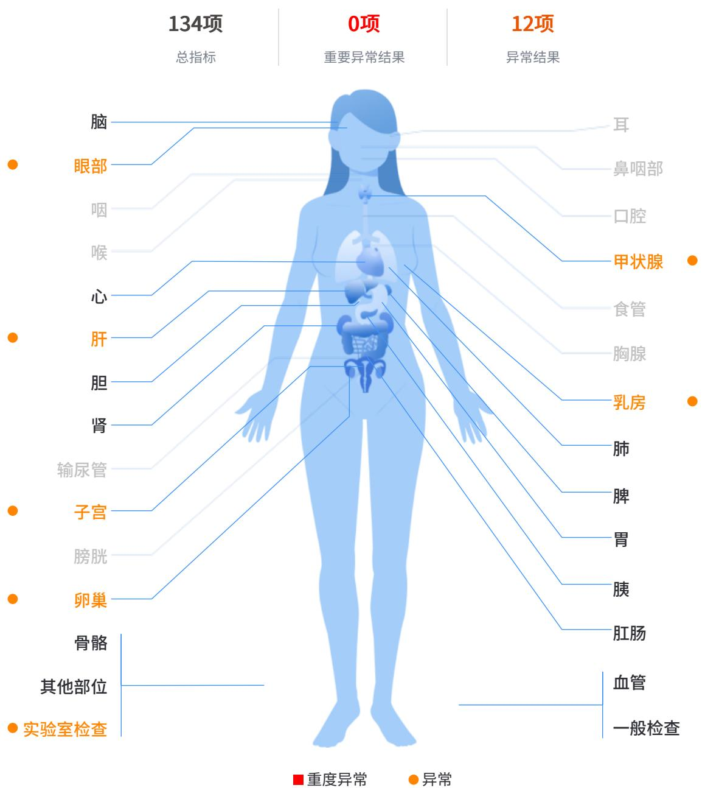
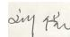
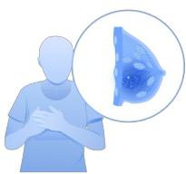
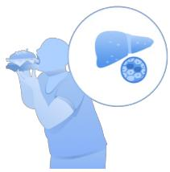
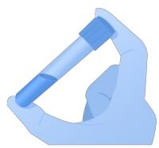
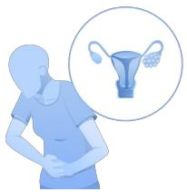
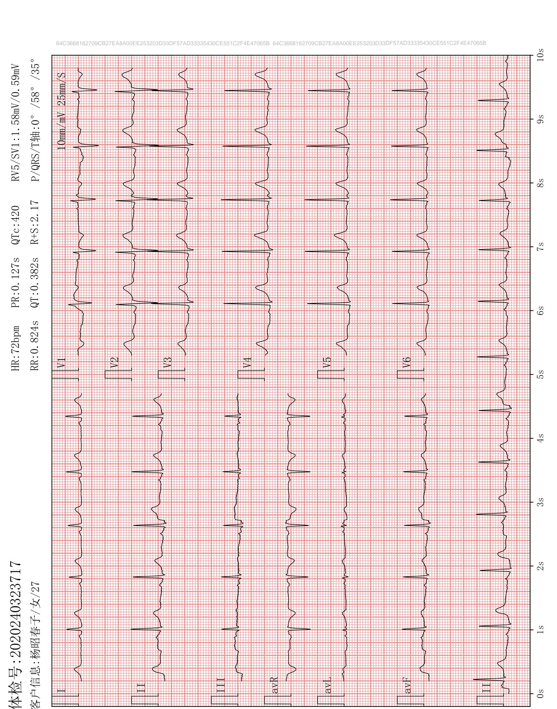

# 健康体检报告

# MEDICAL EXAMINATION REPORT

# 杨昭春子(女)

项目号 T012340101

单位 外语教学与研究出版社有限责任公司

联系电话 159****4490

项目简称 外研社

员工号

类别员工

卡号 0010900203319887

部 门在职

递送地址

递送方式 电子报告

体检号 2020240323717

北京爱康国宾建外门诊部（爱康国宾北京建国门分院）

检查日期 2024.03.23

27/5515

爱康国宾

3 60 健康全管理

爱康集团是中国领先的中高端连锁体检与健康管理集团，通过旗下多个品牌，为团体客户和家庭、个人提供高品质的健康体检、疾病检测、齿科服务、私人医生、职场医疗、疫苗接种、抗衰老等健康管理与医疗服务。截止2022年8月，爱康集团（包括并购基金）已在59大城市设有155家体检与医疗中心。同时爱康集团与全国200多个城市超过800家医疗机构建立合作网络。

爱康国宾健康体检管理集团有限公司版权所有

扫码下载爱康APP

www.ikang.com

# 目录

# CONTENTS

1 体检重要异常结果、复查建议及治疗建议 04 异常情况、专家建议与指导、标准治疗方案  
2 专家建议与指导 05 建议与指导  
3 健康体检结果 07检查详细结果  
4 深度咨询或风险评估产品建议 15  
历年指标变化疾病风险评估  
5 健康咨询类项目说明 16  
6 医学名词科普知识 17医学名词科普知识内容

# 尊敬的杨昭春子女士，您好！

北京爱康国宾建外门诊部（爱康国宾北京建国门分院）感谢您的光临和对我们的信任和支持。现将您2024年03月23日的体检报告呈上。

# 报告阅读说明书

1.您本次体检报告由健康信息、本次体检主要阳性结果和异常情况、专家指导建议及本次体检结果等部分组成。  
2.健康体检数据只是针对本次体检覆盖的相关器官的相关项目或指标的检查结果，并非能覆盖人体全部器官及全部指标。  
3.您的体检报告结论是基于您提供的健康信息及本次临床检查结果，隐瞒和错误的信息都可能会误导医生作出错误的判断。如果您提供的健康信息不完整，可能会导致相关检查结论有偏差。  
4.因为检查方法的不同，针对同一器官或者系统的检查结果可能会有所差异。  
5. 由于体检选项、检查方法及医学本身的局限性，本次体检未见异常并不代表没有疾病，如您有不适症状，请及时到医院就诊。

  
体检重要异常结果图示

# 1.体检重要异常结果、复查建议及治疗建议

# 阳性结果和异常情况

【1】左侧甲状腺结节  
【2】乳腺增生  
【3】屈光不正  
【4】轻至中度脂肪肝  
【5】卵巢多囊改变？  
【6】【妇科检查提示】左侧附件增厚；【彩超提示】左侧卵巢囊肿  
【7】宫颈柱状上皮异位  
【8】宫颈TCT轻度炎症反应性细胞改变  
【9】碱性磷酸酶降低  
【10】尿酸增高  
【11】尿隐血阳性

下载爱康APP

查看彩色报告

# 2.专家建议与指导

# 01 左侧甲状腺结节

是临床常见的病征，恶性病变虽不常见，但术前难以鉴别。若甲状腺结节为孤立结节、突然迅速、无痛地增大或有甲状腺肿瘤家族史者，建议您及时去医院专科做进一步检查，以便明确诊断。

# 02 乳腺增生

1、与雌激素水平有关，一般无明显症状。部分人可出现于月经周期有胀痛感，经前明显，经后减轻。  
2、建议及时到医院乳腺专科诊治和随访，根据医院医嘱进一步检查和定期复查。  
3、保持心情愉快，善于疏泄不良情绪，避免精神过度紧张。  
4、注意膳食平衡，减少脂肪摄入量，多吃蔬菜与水果。  
5、慎用化妆品和含雌激素的药物。

# 03 屈光不正

1、凡是裸眼视力低于1.0（含近视、远视、老视、散光等）能够除外其他原因的均称为屈光不正。  
2、注意用眼卫生，在乘车、走路或躺着时不要看书。  
3、用眼时间稍长可适当闭目休息或做眼保健操和远眺。  
4、建议定期检查视力，到正规医院验光，配戴合适的眼镜。

# 04 轻至中度脂肪肝

1、是体内脂肪在肝脏内蓄积，常因喜食荤食、过量饮酒及肥胖或糖尿病等引起，可造成消化功能异常或肝脏代谢解毒功能的下降，若继续发展，可能会出现肝纤维化或肝硬化。  
2、每年复查一次血脂，肝功能、肝脏B超；伴有高脂血症应及时到消化内科就诊。  
3、严格忌酒，避免使用损肝药物；坚持有氧运动，如快步走、慢跑等，促进脂质代谢。  
4、合理膳食，以低糖、低脂、低盐、高蛋白质、高维生素为原则，少吃油炸煎烤类食物。

# 05 卵巢多囊改变？

1、病因尚不太清楚，主要表现为月经稀发或过少，不孕，肥胖，多毛，双侧卵巢增大，持续无排卵，雄激素过多，雌激素相应减少，以致闭经。  
2、建议必要时到医院专科复查、明确诊断。  
3、建议妇科调理及中医中药治疗。

# 06 【妇科检查提示】左侧附件增厚；【彩超提示】左侧卵巢囊肿

1、可与月经周期变化有关，部分囊肿可自行消退，建议定期复查，必要时于医院妇科诊治。  
2、您此次囊肿较大，建议及时到医院妇科诊治。

# 07 宫颈柱状上皮异位

1、可为生理性改变也可为病理性改变。多见于青春期、生育年龄妇女雌激素分泌旺盛者、口服避孕药或妊娠期，由于雌激素的作用，宫颈鳞柱交界部外移，子宫颈局部呈糜烂样改变。此外，子宫颈上皮内瘤变及早期子宫颈癌也可使子宫颈呈糜烂样改变。  
2、建议定期观察，必要时去医院妇科诊治。

# 08 宫颈TCT轻度炎症反应性细胞改变

建议一年后复查。

# 09 碱性磷酸酶降低

无重要临床意义。

# 10 尿酸增高

1、多因饮酒、高蛋白或过食高嘌呤食物等引起血尿酸增高，提示嘌呤代谢紊乱和（或）尿酸排泄障碍，可为无症状的高尿酸血症。  
2、高尿酸常与肥胖、高血压病、高脂血症、冠心病、2型糖尿病等代谢性疾病并存。高尿酸血症也是动脉硬化的危险因素，因此应引起您的注意。  
3、及时调整饮食结构，忌食高嘌呤食物，如动物内脏、鱼卵、蟹黄、海鱼、豆类、香菇等，多吃五谷杂粮、奶制品、蛋类及水果蔬菜等低嘌呤食物，减少饮酒量。  
4、建议动态观察，定期复查血尿酸（复查前三天不吃高嘌呤食物）。若持续增高，请到医院内分泌专科诊治。

# 11 尿隐血阳性

1、多见于泌尿生殖系统疾病（炎症、结石、肿瘤等），也可见于高血压肾脏改变、糖尿病肾脏病变等，也可见于标本污染。需结合症状分析原因。  
2、建议您复查；若仍阳性，请到医院肾内科进一步检查、诊治。

# 3.健康体检结果

一般检查室  
检查者：赵越   

<table><tr><td>检查项目</td><td>测量结果</td><td>单位</td><td>异常描述</td><td>参考区间</td></tr><tr><td>身高</td><td>166.8</td><td>cm</td><td></td><td></td></tr><tr><td>体重</td><td>62.4</td><td>Kg</td><td></td><td></td></tr><tr><td>体重指数</td><td>22.4</td><td></td><td></td><td>18.5-23.99</td></tr><tr><td>收缩压</td><td>108</td><td>mmHg</td><td></td><td>90.0-139.0</td></tr><tr><td>舒张压</td><td>66</td><td>mmHg</td><td></td><td>60.0-89.0</td></tr><tr><td>初步意见</td><td>未见明显异常</td><td></td><td></td><td></td></tr></table>

内科  
检查者：李丽娜  

<table><tr><td>检查项目</td><td>检查所见</td><td>单位</td></tr><tr><td>病史</td><td>无</td><td></td></tr><tr><td>家族史</td><td>无特殊</td><td></td></tr><tr><td>心率</td><td>67</td><td>次/分</td></tr><tr><td>心律</td><td>齐</td><td></td></tr><tr><td>心音</td><td>正常</td><td></td></tr><tr><td>肺部听诊</td><td>双侧呼吸音未闻及异常</td><td></td></tr><tr><td>肝脏触诊</td><td>肝脏肋下未触及</td><td></td></tr><tr><td>脾脏触诊</td><td>脾脏肋下未触及</td><td></td></tr><tr><td>肾脏叩诊</td><td>双肾区无叩痛</td><td></td></tr><tr><td>内科其它</td><td>无</td><td></td></tr><tr><td>初步意见</td><td>未见明显异常</td><td></td></tr></table>

外科  
检查者：王淑萍   

<table><tr><td>检查项目</td><td>检查所见</td><td>单位</td></tr></table>

下载爱康APP

查看彩色报告

<table><tr><td>皮肤</td><td>未见明显异常</td><td></td></tr><tr><td>浅表淋巴结</td><td>颈部、锁骨上、腋窝及腹股沟未见明显异常</td><td></td></tr><tr><td>甲状腺(外科)</td><td>未见明显异常</td><td></td></tr><tr><td>乳房</td><td>双侧乳腺弥漫性增厚,增厚区与周围乳腺组织分界不明显,条索不伴触痛</td><td></td></tr><tr><td>脊柱</td><td>未见明显异常</td><td></td></tr><tr><td>四肢关节</td><td>未见明显异常</td><td></td></tr><tr><td>肛门、直肠指诊</td><td>未见明显异常</td><td></td></tr><tr><td>外科其它</td><td>无</td><td></td></tr><tr><td>初步意见</td><td>乳腺增生</td><td></td></tr></table>

妇科  
检查者：连雪红   

<table><tr><td>检查项目</td><td>检查所见</td><td>单位</td></tr><tr><td>外阴</td><td>未见明显异常</td><td></td></tr><tr><td>阴道</td><td>未见明显异常</td><td></td></tr><tr><td>宫颈</td><td>宫颈呈现糜烂样改变，范围：I度</td><td></td></tr><tr><td>子宫</td><td>未见明显异常</td><td></td></tr><tr><td>附件</td><td>左侧附件增厚</td><td></td></tr><tr><td>妇科其它</td><td>无</td><td></td></tr><tr><td>初步意见</td><td>1.宫颈柱状上皮异位2.左侧附件增厚</td><td></td></tr></table>

眼科  
检查者：王诗萱、米惠萍   

<table><tr><td>检查项目</td><td>检查所见</td><td>单位</td></tr><tr><td>裸视力(右)</td><td></td><td></td></tr><tr><td>裸视力(左)</td><td></td><td></td></tr><tr><td>矫正视力(右)</td><td>1.2</td><td></td></tr><tr><td>矫正视力(左)</td><td>1.2</td><td></td></tr></table>

色觉

正常

外眼

未见明显异常

眼科其它

无

裂隙灯检查

未见明显异常

初步意见

屈光不正

操作者：张闵

审核者：姜丽梅

血常规   

<table><tr><td>检查项目</td><td>缩写</td><td>测量结果</td><td>提示</td><td>参考区间</td><td>单位</td></tr><tr><td>白细胞计数</td><td>WBC</td><td>8.70</td><td></td><td>3.5-9.5</td><td>10^9/L</td></tr><tr><td>红细胞计数</td><td>RBC</td><td>4.93</td><td></td><td>3.80-5.10</td><td>10^12/L</td></tr><tr><td>血红蛋白</td><td>Hb</td><td>145.00</td><td></td><td>115-150</td><td>g/L</td></tr><tr><td>红细胞比容</td><td>HCT</td><td>0.42</td><td></td><td>0.35-0.45</td><td>%</td></tr><tr><td>平均红细胞体积</td><td>MCV</td><td>85.00</td><td></td><td>82.0-100.0</td><td>fL</td></tr><tr><td>平均红细胞血红蛋白含量</td><td>MCH</td><td>29.40</td><td></td><td>27-34</td><td>Pg</td></tr><tr><td>平均红细胞血红蛋白浓度</td><td>MCHC</td><td>344.00</td><td></td><td>316-354</td><td>g/L</td></tr><tr><td>红细胞分布宽度-变异系数</td><td>RDW-CV</td><td>13.80</td><td></td><td>11-16</td><td>%</td></tr><tr><td>血小板计数</td><td>PLT</td><td>177.00</td><td></td><td>125-350</td><td>10^9/L</td></tr><tr><td>平均血小板体积</td><td>MPV</td><td>9.80</td><td></td><td>6-11</td><td>fL</td></tr><tr><td>血小板分布宽度</td><td>PDW</td><td>14.30</td><td></td><td>9-17</td><td>fL</td></tr><tr><td>淋巴细胞百分比</td><td>LYMPH%</td><td>29.30</td><td></td><td>20-50</td><td>%</td></tr><tr><td>中性粒细胞百分比</td><td>NEUT%</td><td>60.50</td><td></td><td>40-75</td><td>%</td></tr><tr><td>淋巴细胞绝对值</td><td>LYMPH</td><td>2.54</td><td></td><td>1.1-3.2</td><td>10^9/L</td></tr><tr><td>中性粒细胞绝对值</td><td>NEUT</td><td>5.25</td><td></td><td>1.8-6.3</td><td>10^9/L</td></tr><tr><td>红细胞分布宽度-标准差</td><td>RDW-SD</td><td>40.0</td><td></td><td>39-52.0</td><td>fL</td></tr><tr><td>血小板压积</td><td>PCT</td><td>0.17</td><td></td><td>0.15-0.50</td><td>%</td></tr><tr><td>单核细胞百分比</td><td>MONO%</td><td>5.00</td><td></td><td>3.5-9.5</td><td>%</td></tr></table>

<table><tr><td>单核细胞绝对值</td><td>MONO</td><td>0.43</td><td>0.1-0.6</td><td>10^9/L</td></tr><tr><td>嗜酸性细胞百分比</td><td>EOS%</td><td>5.20</td><td>0.0-8.0</td><td>%</td></tr><tr><td>嗜酸性细胞绝对值</td><td>EOS</td><td>0.45</td><td>0.02-0.52</td><td>10^9/L</td></tr><tr><td>嗜碱性细胞百分比</td><td>BASO%</td><td>0.00</td><td>0-1</td><td>%</td></tr><tr><td>嗜碱性细胞绝对值</td><td>BASO</td><td>0.00</td><td>0.00-0.06</td><td>10^9/L</td></tr></table>

注：本结果只对此条码来样负责，仅供临床参考。

# 小结

# 未见明显异常

操作者：陈青芳

审核者：姜丽梅

尿常规   

<table><tr><td>检查项目</td><td>缩写</td><td>测量结果</td><td>提示</td><td>参考区间</td><td>单位</td></tr><tr><td>尿比重</td><td>SG</td><td>1.025</td><td></td><td>1.005-1.030</td><td></td></tr><tr><td>尿酸碱度</td><td>PH</td><td>6.0</td><td></td><td>4.5-8.0</td><td></td></tr><tr><td>尿白细胞</td><td>LEU</td><td>阴性</td><td></td><td>阴性</td><td></td></tr><tr><td>尿亚硝酸盐</td><td>NIT</td><td>阴性</td><td></td><td>阴性</td><td></td></tr><tr><td>尿蛋白质</td><td>PRO</td><td>阴性</td><td></td><td>阴性</td><td></td></tr><tr><td>尿糖</td><td>GLU</td><td>阴性</td><td></td><td>阴性</td><td></td></tr><tr><td>尿酮体</td><td>KET</td><td>阴性</td><td></td><td>阴性</td><td></td></tr><tr><td>尿胆原</td><td>URO</td><td>阴性</td><td></td><td>阴性</td><td></td></tr><tr><td>尿胆红素</td><td>BIL</td><td>阴性</td><td></td><td>阴性</td><td></td></tr><tr><td>尿隐血</td><td>BLD</td><td>2+</td><td>↑</td><td>阴性</td><td></td></tr><tr><td>尿镜检红细胞</td><td>RBC</td><td>0</td><td></td><td>0-3</td><td>/HP</td></tr><tr><td>尿镜检白细胞</td><td>WBC</td><td>0</td><td></td><td>0-5</td><td>/HP</td></tr><tr><td>管型</td><td>CAST</td><td>0</td><td></td><td>0-1</td><td></td></tr><tr><td>上皮细胞</td><td>EC</td><td>0</td><td></td><td>0-5</td><td>/HP</td></tr><tr><td>无机盐类</td><td>UIS</td><td>无</td><td></td><td></td><td></td></tr></table>

# 小结

# 尿隐血阳性

注：本结果只对此条码来样负责，仅供临床参考。

呼气实验室

操作者：张闵

审核者：姜丽梅

妇科检验项目  

<table><tr><td>检查项目</td><td>缩写</td><td>测量结果</td><td>提示</td><td>参考区间</td><td>单位</td></tr><tr><td>碳14-尿素呼气试验</td><td>14C-UBT</td><td>15.00</td><td colspan="3">0.00-100.00</td></tr><tr><td>小结</td><td>未见明显异常</td><td></td><td></td><td></td><td></td></tr></table>

注：本结果只对此条码来样负责，仅供临床参考。

操作者：洪蒋宝

审核者：郑建贺

实验室检查  

<table><tr><td>检查项目</td><td>缩写</td><td>测量结果</td><td>提示</td><td>参考区间</td><td>单位</td></tr><tr><td>宫颈TCT</td><td></td><td>未见上皮内病变及恶性 细胞(NILM)良性反应 细胞改变(轻度炎症)</td><td></td><td></td><td></td></tr><tr><td>小结</td><td colspan="5">宫颈TCT:轻度炎症反应性细胞改变</td></tr></table>

注：本结果只对此条码来样负责，仅供临床参考。

操作者：王晨宇 陈京萍 鲁浩伟

审核者：康海燕 王友友 刘宏涛

<table><tr><td>检查项目</td><td>缩写</td><td>测量结果</td><td>提示</td><td>参考区间</td><td>单位</td></tr><tr><td>★ HPV16型</td><td>HPV16</td><td>阴性</td><td></td><td>阴性</td><td></td></tr><tr><td>★ HPV18型</td><td>HPV18</td><td>阴性</td><td></td><td>阴性</td><td></td></tr><tr><td>★ HPV31型</td><td>HPV31</td><td>阴性</td><td></td><td>阴性</td><td></td></tr><tr><td>★ HPV33型</td><td>HPV33</td><td>阴性</td><td></td><td>阴性</td><td></td></tr><tr><td>★ HPV35型</td><td>HPV35</td><td>阴性</td><td></td><td>阴性</td><td></td></tr><tr><td>★ HPV39型</td><td>HPV39</td><td>阴性</td><td></td><td>阴性</td><td></td></tr><tr><td>★ HPV45型</td><td>HPV45</td><td>阴性</td><td></td><td>阴性</td><td></td></tr><tr><td>★ HPV51型</td><td>HPV51</td><td>阴性</td><td></td><td>阴性</td><td></td></tr><tr><td>★ HPV52型</td><td>HPV52</td><td>阴性</td><td></td><td>阴性</td><td></td></tr><tr><td>★ HPV53型</td><td>HPV53</td><td>阴性</td><td></td><td>阴性</td><td></td></tr><tr><td>★ HPV56型</td><td>HPV56</td><td>阴性</td><td></td><td>阴性</td><td></td></tr><tr><td>★ HPV58型</td><td>HPV58</td><td>阴性</td><td></td><td>阴性</td><td></td></tr><tr><td>★ HPV59型</td><td>HPV59</td><td>阴性</td><td></td><td>阴性</td><td></td></tr><tr><td>★ HPV66型</td><td>HPV66</td><td>阴性</td><td></td><td>阴性</td><td></td></tr><tr><td>★ HPV68型</td><td>HPV68</td><td>阴性</td><td></td><td>阴性</td><td></td></tr><tr><td>★ HPV6型</td><td>HPV6</td><td>阴性</td><td></td><td>阴性</td><td></td></tr><tr><td>★ HPV11型</td><td>HPV11</td><td>阴性</td><td></td><td>阴性</td><td></td></tr><tr><td>★ HPV43型</td><td>HPV43</td><td>阴性</td><td></td><td>阴性</td><td></td></tr><tr><td>★ HPV42型</td><td>HPV42</td><td>阴性</td><td></td><td>阴性</td><td></td></tr><tr><td>★ HPV44型</td><td>HPV44</td><td>阴性</td><td></td><td>阴性</td><td></td></tr><tr><td>★ HPV40型</td><td>HPV40</td><td>阴性</td><td></td><td>阴性</td><td></td></tr><tr><td>★ HPV26型</td><td>HPV26</td><td>阴性</td><td></td><td>阴性</td><td></td></tr><tr><td>★ HPV55型</td><td>HPV55</td><td>阴性</td><td></td><td>阴性</td><td></td></tr><tr><td>★ HPV61型</td><td>HPV61</td><td>阴性</td><td></td><td>阴性</td><td></td></tr><tr><td>★ HPV81型</td><td>HPV81</td><td>阴性</td><td></td><td>阴性</td><td></td></tr><tr><td>★ HPV83型</td><td>HPV83</td><td>阴性</td><td></td><td>阴性</td><td></td></tr><tr><td>★ HPV82型</td><td>HPV82</td><td>阴性</td><td></td><td>阴性</td><td></td></tr><tr><td>丙氨酸氨基转移酶</td><td>ALT</td><td>16</td><td></td><td>0-40</td><td>U/L</td></tr><tr><td>天门冬氨酸氨基转移酶</td><td>AST</td><td>15</td><td></td><td>0-35</td><td>U/L</td></tr><tr><td>γ-谷氨酰转移酶</td><td>GGT</td><td>16</td><td></td><td>7-45</td><td>U/L</td></tr><tr><td>碱性磷酸酶</td><td>ALP</td><td>34</td><td>↓</td><td>35-100</td><td>U/L</td></tr><tr><td>总胆红素</td><td>TBIL</td><td>9.9</td><td></td><td>0-21</td><td>μmol/L</td></tr><tr><td>直接胆红素</td><td>DBIL</td><td>3.1</td><td></td><td>0-10</td><td>μmol/L</td></tr><tr><td>间接胆红素</td><td>IBIL</td><td>6.8</td><td></td><td></td><td>μmol/L</td></tr><tr><td>尿素</td><td>UREA</td><td>4.77</td><td></td><td>2.6-7.5</td><td>mmol/L</td></tr><tr><td>肌酐</td><td>Cr</td><td>57</td><td></td><td>41-73</td><td>μmol/L</td></tr><tr><td>尿酸</td><td>UA</td><td>434</td><td>↑</td><td>150-360</td><td>μmol/L</td></tr><tr><td>空腹血葡萄糖</td><td>FBG</td><td>5.30</td><td></td><td>3.9-6.1</td><td>mmol/L</td></tr><tr><td>总胆固醇</td><td>TC</td><td>4.74</td><td></td><td>0-5.20</td><td>mmol/L</td></tr><tr><td>甘油三酯</td><td>TG</td><td>1.21</td><td></td><td>0.40-1.70</td><td>mmol/L</td></tr><tr><td>高密度脂蛋白胆固醇</td><td>HDL-C</td><td>1.20</td><td></td><td>1.0-2.1</td><td>mmol/L</td></tr><tr><td>低密度脂蛋白胆固醇</td><td>LDL-C</td><td>3.24</td><td></td><td>0-3.37</td><td>mmol/L</td></tr><tr><td>甲胎蛋白定量</td><td>AFP</td><td>14.04</td><td></td><td>0-20</td><td>ng/ml</td></tr><tr><td>癌胚抗原定量</td><td>CEA</td><td>0.98</td><td></td><td>0-5</td><td>ng/ml</td></tr></table>

注：本结果只对此条码来样负责，仅供临床参考。

小结

1.尿酸增高   
2.碱性磷酸酶降低

心电图室

检查者：

超声检查室  

<table><tr><td>检查项目</td><td>检查所见</td><td>单位</td></tr><tr><td>心电图</td><td>窦性心律 正常心电图</td><td></td></tr><tr><td>初步意见</td><td>未见明显异常</td><td></td></tr></table>

检查者：刘丹

<table><tr><td>检查项目</td><td>检查所见</td><td>单位</td></tr><tr><td>肝</td><td>肝脏形态略显饱满,肝内实质回声细腻,分布欠均匀,后方轻度回声衰减,血管纹理走行尚清晰,门静脉正常。CDFI:血流显示正常。</td><td></td></tr><tr><td>胆</td><td>未见明显异常</td><td></td></tr><tr><td>胰</td><td>未见明显异常</td><td></td></tr><tr><td>脾</td><td>未见明显异常</td><td></td></tr><tr><td>双肾</td><td>未见明显异常</td><td></td></tr><tr><td>子宫</td><td>子宫形态大小正常,肌层回声均匀,内膜线显示清晰</td><td></td></tr><tr><td>附件</td><td>左侧附件区可见近无回声,大小约52×37mm,透声欠清晰。右侧卵巢内可见多个大小不等的卵泡</td><td></td></tr><tr><td>乳腺</td><td>双侧乳腺腺体致密内部回声增强,结构紊乱,分布不均腺管未见明显扩张,CDFI;未见明显异常血流信号。</td><td></td></tr></table>

放射科  

<table><tr><td>甲状腺</td><td>甲状腺左侧叶见边界尚清晰的低回声结节，大小约3×2mm。CDFI：血流未见明显异常。
甲状腺右侧叶及峡部未见明显异常</td></tr><tr><td>★心脏</td><td>1、心脏各腔大小在正常范围，室壁不增厚，静息状态下室壁运动未见明显异常。
2、二尖瓣不增厚，开放不受限，CDFI示：未见明显异常。PDE：二尖瓣口左室面血流频谱示E峰&gt;A峰。
3、三尖瓣、主动脉瓣、肺动脉不增厚，开放不受限，CDFI示：未见明显异常。</td></tr><tr><td>初步意见</td><td>1.轻至中度脂肪肝
2.乳腺增生
3.左侧甲状腺结节（注意复查）
4.左侧卵巢囊肿（建议复查）
5.卵巢多囊改变（？）</td></tr></table>

检查者： 王润义 审核者： 王润义

<table><tr><td>检查项目</td><td>检查所见</td><td>单位</td></tr><tr><td>胸部</td><td>双肺纹理较清晰，肺野未见明显实变影。双肺门结构尚清晰。心影大小尚属正常范围之内。双侧膈面光整，肋膈角锐利。</td><td></td></tr><tr><td>颈部</td><td>颈椎生理曲度正常，椎体骨质、椎间隙及附件骨结构正常。</td><td></td></tr><tr><td>初步意见</td><td>未见明显异常</td><td></td></tr></table>

主检医师：

iKang爱康

  
扫码下载爱康APP

想随时随地看报告？

想对比您的历史体检报告？

爱康APP,检前检后全管理

约体检

查报告

历史数据对比

专家解读

三甲医院挂号

iKangCare+

有人管的体检

# 4.深度咨询或风险评估产品建议

# 尿立检-尿脱落细胞DNA甲基化检测

(1) 尿路上皮癌常见问题  
尿路上皮癌（Urothelial carcinoma）是起源于尿路上皮的一种多源性的恶性肿瘤，可发生于膀胱、肾盂和输尿管。2015年，我国膀胱癌发病率和死亡人数分别为8.05万和3.29万人[1]，其发生是复杂、多因素、多步骤的病理变化过程，较为明显的两大致病危险因素是吸烟和长期接触工业化学产品[2]，其他因素还包括慢性感染[3]、使用环磷酰胺[3]或吡格列酮[4]以及染发[5]等。  
(2) 尿路上皮癌筛查有助于提高患者5年生存率

研究发现, 0期、I期、II期、III期和IV期膀胱癌患者的5年生存率分别为 $98\%$ 、 $88\%$ 、 $63\%$ 、 $46\%$ 和 $15\% [6]$ 。如果尿路上皮细胞发生癌变, 那癌变的细胞会和正常细胞一起脱落随尿液排出, 信号可在尿液中检测到, 早发现能提高患者生存。

(3) 尿立检? 是首个获得FDA “突破性医疗器械” 认证的膀胱癌检测产品

尿立检？是首个获得FDA“突破性医疗器械”(BTD)认定的膀胱癌检测产品，已被《中国泌尿外科和男科疾病诊断治疗指南》收录[2]，并且获得国家发明专利和欧盟IVDDCE产品认证及南德TUV ISO 13485医疗器械质量管理体系认证。尿立检？采用分子诊断技术对尿液样本DNA进行检测，判断尿路上皮是否存在癌前病变或癌变病灶，为尿路上皮癌筛查提供便捷可靠的检测方案。

# 尿立检

爱康关爱您的泌尿健康

扫描右侧二维码购买

  
扫码购买

下载爱康APP

查看彩色报告

# 5.健康咨询类项目说明

以下项目属于健康咨询类服务，不作为体检诊断项目，仅作为参考，评测结果将以独立的报告形式呈现。本体检报告不包含独立检测项目

# ★ 人工智能-视网膜影像慢病评估优悦套餐

项目说明

该项目是采用人工智能高科技，通过视网膜检测，评估包括高血压、糖尿病、脑卒中、脑肿瘤、青光眼、黄斑变性、视网膜脱落、眼底出血等数十种健康风险的健康咨询类项目，无创、便捷、可跟踪。

# ★ 南方基因-生殖道微生态分子检测

项目说明

用于细菌性阴道病(BV)、需氧菌性阴道病(AV)、外阴阴道假丝酵母菌病(VVC)、滴虫性阴道病(TV)、生殖道支原体感染、生殖器疱疹、沙眼衣原体感染、软下疳等检测及宫颈癌易感风险评估。

  
下载爱康APP  
随时随地看报告

# 6.医学名词科普知识

医学名词科普知识内容，仅是帮助您解读理解体检报告使用，所有名词的解释内容，均出自国家权威性专业典籍，部分内容略有增减，仅供您阅读参考。

# 什么是乳腺增生？

乳腺增生又名乳腺结构不良，可分为囊性小叶增生、腺性小叶增生和纤维性小叶增生。乳腺增生是生理过程中，或在某些激素分泌失调情况下，表现出乳腺组织成分的大小和数量构呈比例及形态上的周期性变化，是一组临床综合征。乳腺增生并非炎症性或肿瘤性疾病，甚至其大多数情况下都是代表乳腺组织对激素的生理性反应，而不是真正的疾病。仅有少部分可能属于疾病，其中极少数出现非典型增生，可再发展成原位癌，甚至最终演变

成为浸润性乳腺癌。注意，这个过程并非线性进展，随时可以在浸润性乳腺癌之前的任一环节停下来，所以不能把乳腺增生视作癌前期病变。乳腺增生可发生于青春期至绝经期的任何年龄，以20～40岁多见，35～40岁为高峰。常为双侧，亦可单侧发病，病变呈多发、弥漫性分布。多无明显症状；少数可有疼痛感或胀痛，疼痛与月经周期有关，经前明显，经后减轻；部分患者疼痛与情绪有关。发病初期可无明显体征，到一定阶段表现出乳腺组织增厚感或结节感，可有压痛。腋下淋巴结不肿大。

# 什么是甲状腺结节？

甲状腺结节是指甲状腺内散在的并能和周围甲状腺组织清楚分界的局限性肿块，其病因分为炎症、肿瘤、转移等。甲状腺结节多为良性，恶性结节仅占5%左右。多数良性甲状腺结节无明显临床症状，当肿大结节压迫周围组织时，出现声音嘶哑、憋气、吞咽困难等症状。甲状腺结节重点需鉴别良、恶性，及时到内分泌科或普外科就诊。甲状腺结节者，下列情况需引起足够的重视：①颈部放射线检查治疗史；②有甲状腺癌家族史；③年龄>70

岁；④结节增长迅速且直径 $>2 \mathrm{~cm}$ ；⑤伴持续性声音嘶哑、发声困难、吞咽困难和呼吸困难；⑥结节质地硬、形状不规则、固定；⑦伴颈部淋巴结肿大。

# 什么是屈光不正？

在调节松弛的状态下，正视状态的眼球（正常屈光），入射光线经过角膜、晶状体后聚焦于视网膜表面，形成清晰的图像传入大脑。晶状体具有弹性，年轻人的弹性更好。调节时，睫状肌调整晶状体形状以更好的聚焦影像。屈光不正是指眼在调节松弛的状态下，平行光线经过眼的屈光系统屈折后，不能把光线聚焦成清晰的图像在视网膜上，而成像于视网膜前或后，造成眼视物模糊。屈光不正包括远视、近视和散光。屈光不正的主要症状为

视远和（或）视近时视物模糊。有时候，睫状肌张力过高可能引起头痛症状。偶尔，长时间注视可能导致眼表面干燥，引起眼部刺激症状、眼痒、视觉疲劳、异物感和眼红。儿童表现为阅读时皱眉和过度眨眼或者揉眼。矫治近视眼需配戴合适度数的凹透镜，使平行光线在进入眼以前发散，经眼屈光系统后聚焦于视网膜上。同理，矫治远视眼需配戴合适度数的凸透镜，矫治散光需配戴柱镜或球柱镜。散光眼即使度数很轻，若有视力下降，或出现视疲劳症状者，都应当配戴矫正眼镜。对于高度散光眼或不规则散光眼，当镜片无法矫治时可以考虑配戴硬性接触镜或行准分子激光手术治疗。

下载爱康APP

查看彩色报告

# 什么是脂肪肝？

指肝脏内脂肪含量增多，过度充积于肝细胞内超过正常范围。脂肪充盈于肝细胞内可减弱其功能，易受亲肝性毒物所损害，甚至发展为肝硬化。脂肪肝为可逆性，在合理治疗后可恢复正常。因此早期诊断有重要临床意义。大多数脂肪肝患者没有症状。有些患者可感觉疲劳、不适或右上腹不适。B超、CT有辅助诊断意义，确诊必须依靠肝活检。脂肪肝形成原因包括饮食不当、长期大量饮酒、过度肥胖等。防治脂肪肝主要靠调整饮食习惯和结

构。

# 什么是尿酸增高？

尿酸是体内和食物中嘌呤代谢的最终产物，又是细胞新陈代谢的副产品。肝是尿酸的主要生成场所，大部分尿酸通过肾排，血液中存在少量的尿酸。当肾脏不能清除尿液中足够的尿酸时，血液中尿酸增高，血中过多的尿酸可导致尿酸盐结晶沉积于关节内；同时食用高嘌呤饮食并饮酒可增加尿酸增高程度。尿酸增高不仅会引起痛风发作，还可导致肾脏病变。临床资料证实，尿酸还与高血压、糖尿病、冠心病等疾病密切相关。尿酸增高常见于

肾小球滤过功能损伤、原发性痛风、血液病、恶性肿瘤等疾病，长期使用利尿剂和抗结核药也会导致尿酸增高。对于首次检出尿酸增高者，建议复查，明确病因，尽早治疗；对于有病史受检者，及时到肾内科就诊。

# 什么是卵巢囊肿？

卵巢肿瘤是常见的妇科肿瘤，其中最为常见的是卵巢囊肿。良性卵巢囊肿的常见并发症为蒂扭转、破裂、感染和恶变。

体检号：2020240323717  
客户信息：杨昭春子/女/27  
  
64C3668162709CB27EA8A00EE253203D33DF57AD33335430CE551C2F4E47065B 64C3668162709CB27EA8A00EE253203D33DF57AD33335430CE551C2F4E47065B